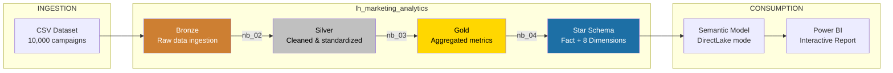
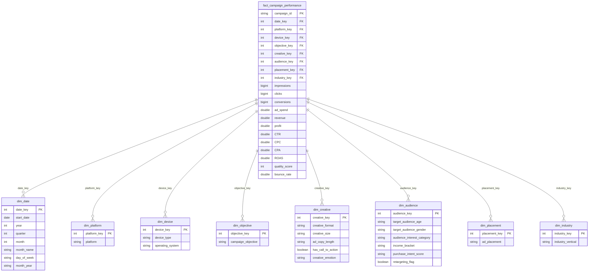
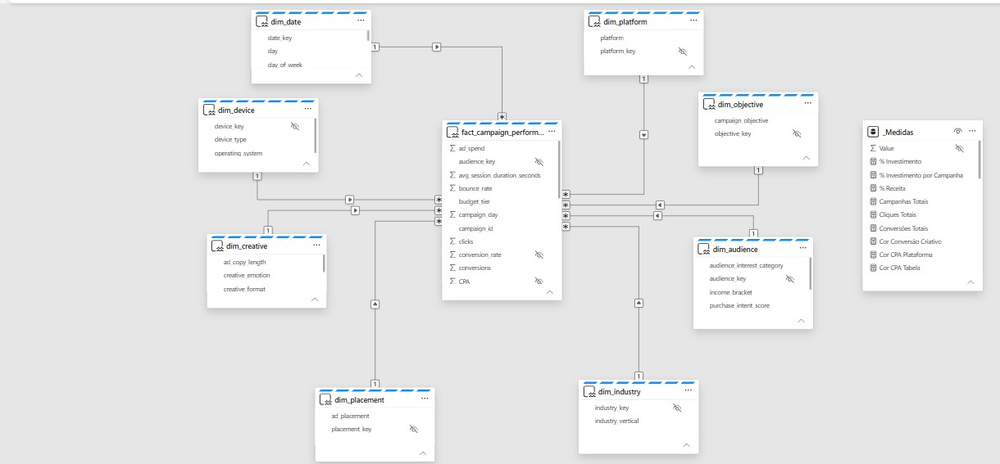
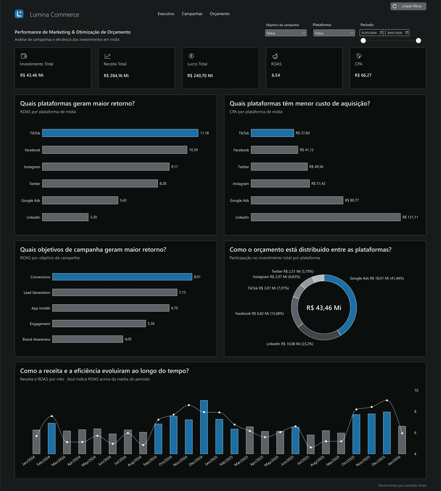
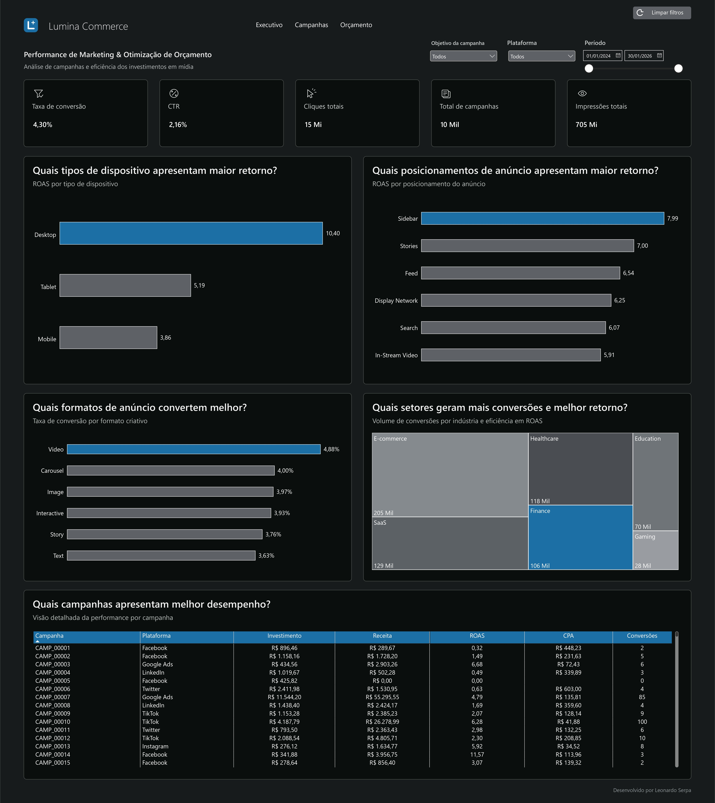
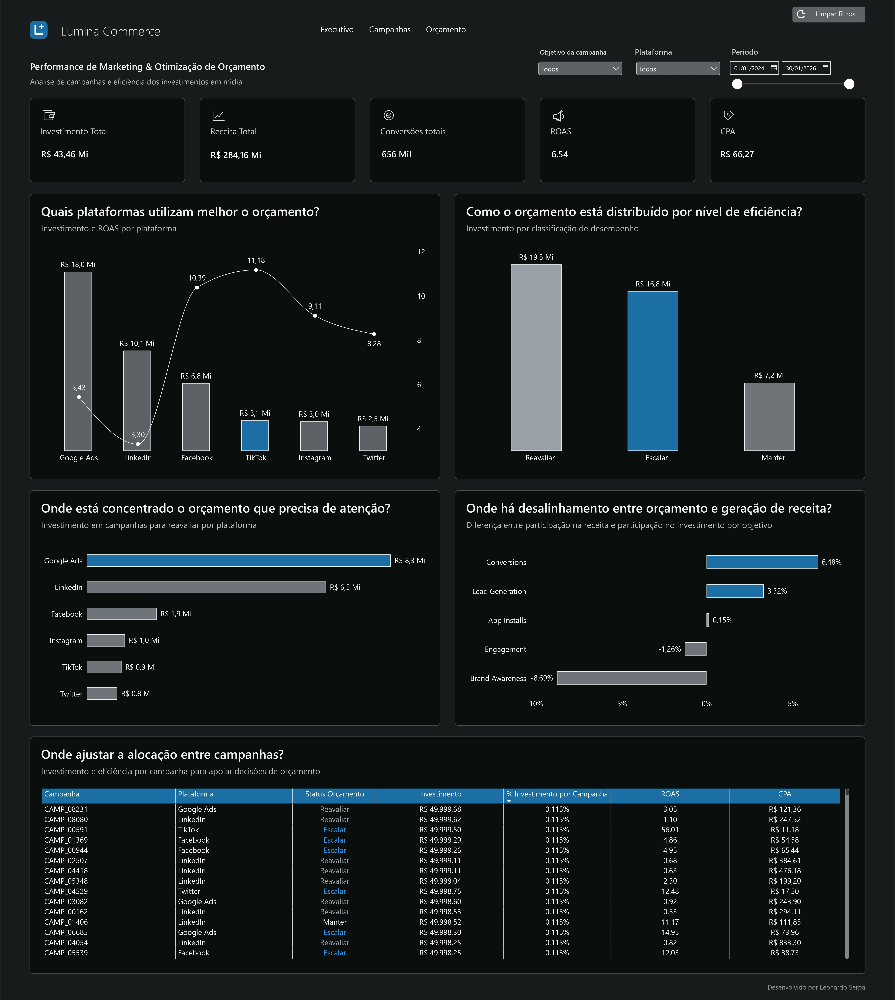
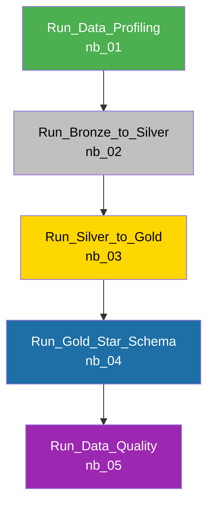
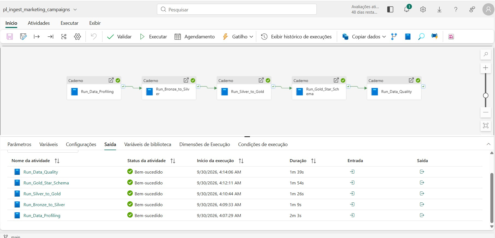

# Marketing Budget Optimization

> Digital marketing analytics and budget optimization platform built on **Microsoft Fabric**, leveraging **Medallion Architecture**, **Star Schema** dimensional modeling, **DirectLake** semantic model, and an interactive **Power BI** reporting suite.

[Português](README.md) | [English](README.en.md)


---

## Overview

This end-to-end analytics project evaluates **10,000 digital advertising campaigns** across multiple platforms to identify high-impact opportunities for ad spend optimization. The data lifecycle covers raw CSV ingestion into a Microsoft Fabric Lakehouse, data profiling, transformation through Bronze, Silver, and Gold layers, dimensional modeling, automated Data Quality validation, and business intelligence consumption via DirectLake.

### Key Deliverables

- **Automated Data Pipeline** with sequential orchestrator execution and dependency controls.
- **Star Schema Dimensional Model** featuring 1 fact table and 8 dimension tables in Delta format.
- **28+ Business DAX Measures** organized into structured display folders (*Financial, Performance, Volume, Formatting*).
- **Power BI Report** structured into 3 analytical storytelling views (*Executive, Campaigns, and Budget*), providing actionable insights on ROAS, CPA, budget allocation gaps, and strategic recommendations.
- **Data Quality Framework** with automated threshold checks and a strict production Quality Gate.

---

## Architecture

The project follows the Microsoft-recommended **Medallion Architecture** (Bronze → Silver → Gold) within Microsoft Fabric.



---

## Repository Structure

```
fabric-marketing-budget-optimization-main/
│
├── README.md                                         # Documentation in Portuguese
├── README.en.md                                      # Documentation in English (this file)
├── LICENSE                                           # MIT License
├── data/                                             # Project raw dataset
│   └── tech_advertising_campaigns_dataset.csv       # Source dataset (10,000 records)
│
├── fabric/                                           # Microsoft Fabric Workspace artifacts
│   ├── README.md (.en.md)                            # Fabric workspace items technical guide (PT / EN)
│   ├── lakehouse/
│   │   └── lh_marketing_analytics.Lakehouse/         # Unified Lakehouse
│   │
│   ├── notebooks/
│   │   ├── nb_01_data_profiling.Notebook/            # Exploratory data profiling & anomalies
│   │   ├── nb_02_bronze_to_silver.Notebook/          # Bronze → Silver transformation & cleaning
│   │   ├── nb_03_silver_to_gold.Notebook/            # Silver → Gold analytical aggregations
│   │   ├── nb_04_gold_star_schema.Notebook/          # Dimensional modeling (Fact & Dimensions)
│   │   └── nb_05_data_quality.Notebook/              # Automated testing framework & Quality Gate
│   │
│   ├── pipelines/
│   │   └── pl_ingest_marketing_campaigns.DataPipeline/  # Master orchestration pipeline
│   │
│   ├── semantic_models/
│   │   └── sm_marketing_analytics.SemanticModel/     # DirectLake semantic model
│   │
│   └── reports/
│       └── Marketing_Analytics_Budget_Optimization.Report/  # Power BI analytical report
│
└── docs/                                             # Extended technical documentation
    ├── README.md (.en.md)                            # Documentation hub & reading index
    ├── architecture.md (.en.md)                      # Architecture decisions & design patterns
    ├── data-dictionary.md (.en.md)                   # Comprehensive data catalog & schemas
    ├── notebooks-guide.md (.en.md)                   # Notebook execution & extension guide
    ├── semantic-model-guide.md (.en.md)              # Semantic model & DAX reference
    └── images/                                       # High-resolution screenshots & diagrams
```

---

## Dataset

| Attribute | Details |
|:---|:---|
| **Source File** | `data/tech_advertising_campaigns_dataset.csv` |
| **Record Count** | 10,000 ad campaigns |
| **Feature Count** | 41 attributes |
| **Granularity** | 1 row per campaign |
| **Domain** | Digital Advertising & Growth Marketing |

### Key Attribute Categories

| Category | Columns / Fields |
|:---|:---|
| **Identification & Temporal** | `campaign_id`, `start_date`, `quarter`, `day_of_week`, `hour_of_day` |
| **Campaign Strategy** | `campaign_objective`, `platform`, `ad_placement`, `budget_tier` |
| **Creative Assets** | `creative_format`, `creative_size`, `ad_copy_length`, `creative_emotion`, `has_call_to_action` |
| **Target Audience** | `target_audience_age`, `target_audience_gender`, `audience_interest_category`, `income_bracket` |
| **Device & Technology** | `device_type`, `operating_system` |
| **Baseline Performance** | `impressions`, `clicks`, `conversions`, `ad_spend`, `revenue` |
| **Calculated KPIs** | `CTR`, `CPC`, `conversion_rate`, `CPA`, `ROAS`, `profit` |
| **On-Site Behavior** | `bounce_rate`, `avg_session_duration_seconds`, `pages_per_session`, `quality_score` |

---

## Dimensional Model (Star Schema)





---

## KPIs and DAX Measures

### Financial

| Measure | DAX Expression | Format |
|:---|:---|:---|
| **Investimento Total** | `SUM(fact[ad_spend])` | Currency (`R$ #,0.00`) |
| **Receita Total** | `SUM(fact[revenue])` | Currency (`R$ #,0.00`) |
| **Lucro Total** | `[Receita Total] - [Investimento Total]` | Currency (`R$ #,0.00`) |
| **Margem de Lucro** | `DIVIDE([Lucro Total], [Receita Total]) × 100` | Decimal (`0.00`) |
| **% Investimento** | `DIVIDE([Investimento Total], CALCULATE([Investimento Total], REMOVEFILTERS))` | Percentage (`%`) |
| **% Receita** | `DIVIDE([Receita Total], CALCULATE([Receita Total], REMOVEFILTERS))` | Percentage (`%`) |
| **Gap Alocação** | `[% Receita] - [% Investimento]` | Percentage (`%`) |

### Performance

| Measure | DAX Expression | Format |
|:---|:---|:---|
| **ROAS** | `DIVIDE([Receita Total], [Investimento Total])` | Decimal (`#,0.00`) |
| **CPA** | `DIVIDE([Investimento Total], [Conversões Totais])` | Currency (`R$ #,0.00`) |
| **CTR** | `DIVIDE([Cliques Totais], [Impressões Totais]) × 100` | Decimal (`0.00`) |
| **CPC** | `DIVIDE([Investimento Total], [Cliques Totais])` | Currency (`R$ #,0.00`) |
| **Taxa de Conversão** | `DIVIDE([Conversões Totais], [Cliques Totais]) × 100` | Decimal (`0.00`) |

### Volume

| Measure | DAX Expression | Format |
|:---|:---|:---|
| **Impressões Totais** | `SUM(fact[impressions])` | Integer (`#,0`) |
| **Cliques Totais** | `SUM(fact[clicks])` | Integer (`#,0`) |
| **Conversões Totais** | `SUM(fact[conversions])` | Integer (`#,0`) |
| **Total de Campanhas** | `DISTINCTCOUNT(fact[campaign_id])` | Integer (`#,0`) |

### Calculated Column

| Column Name | Business Logic |
|:---|:---|
| **Status Orçamento** | Evaluates and labels each campaign as **Scale** (ROAS ≥ median and CPA ≤ median), **Reevaluate** (ROAS < median and CPA > median, or zero conversions), or **Maintain** (all other cases). |

---

## Power BI Interactive Report

The analytical dashboard was developed in Power BI connected to the Fabric Lakehouse via **DirectLake** mode (ensuring instant, memory-speed queries without scheduled refreshes). The reporting application is structured across **3 analytical storytelling pages**:

### 1. Executive
Macro overview of performance and financial return. Features consolidated high-level KPIs (Total Ad Spend, Revenue, Profit, global ROAS of 6.54, and CPA), a platform efficiency ranking highlighting top-return and lowest acquisition channels, performance segmented by campaign objective, budget share breakdown (donut chart), and monthly financial trend analysis tracking revenue growth against efficiency margins.



### 2. Campaigns
Tactical deep dive into conversion drivers and creative vectors. Evaluates engagement efficiency metrics (Conversion Rate of 4.30%, CTR, Clicks, and Impressions), device performance highlighting Desktop dominance, ad placement efficiency (Sidebar and Stories), high-converting creative formats (led by Video), industry vertical breakdown (E-commerce and SaaS treemaps), and a granular campaign-level diagnostic grid.



### 3. Budget
Decision-making cockpit for capital allocation and media budget optimization. Correlates Ad Spend against ROAS across channels, segments capital allocation by efficiency status (*Reevaluate: R$ 19.5M, Scale: R$ 16.8M, Maintain: R$ 7.2M*), pinpoints concentrated capital in underperforming campaigns, highlights the Allocation Gap (discrepancy between budget share and generated revenue share by objective), and delivers immediate, campaign-level action recommendations.



---

## Data Pipeline

The master pipeline `pl_ingest_marketing_campaigns` orchestrates notebook execution sequentially with strict success dependencies:



Each stage must complete with zero errors before triggering downstream jobs. Timeout is set to 12 hours per activity.



---

## How to Run

### Prerequisites

- An active **Microsoft Fabric** workspace with enabled Fabric Capacity (Trial or F-SKU).
- **Contributor** permissions or higher in the Fabric workspace.

### Step-by-Step Deployment

1. **Import the repository** into your Microsoft Fabric workspace using Git Integration.
2. **Upload the source CSV** (`data/tech_advertising_campaigns_dataset.csv`) to `Files/bronze/raw/` in the `lh_marketing_analytics` Lakehouse.
3. **Trigger the pipeline** `pl_ingest_marketing_campaigns` (runs all notebooks sequentially from profiling to quality gate).
4. **Synchronize the semantic model** `sm_marketing_analytics` in DirectLake mode.
5. **Open the report** `Marketing_Analytics_Budget_Optimization`.

### Manual Notebook Execution (Order of Precedence)

```
nb_01_data_profiling      → Exploratory analysis, cardinality & distribution checks
nb_02_bronze_to_silver    → Schema casting, KPI recalculation & data cleansing
nb_03_silver_to_gold      → Business aggregations & summary analytical tables
nb_04_gold_star_schema    → Star schema creation (fact & 8 surrogate-keyed dimensions)
nb_05_data_quality        → Automated tests, referential integrity & Quality Gate
```

---

## Technical Documentation

| Document | Description |
|:---|:---|
| [Architecture Guide](docs/architecture.en.md) | Technical decisions, trade-offs, and design patterns |
| [Data Dictionary](docs/data-dictionary.en.md) | Full schemas, column definitions, and data types |
| [Notebooks Guide](docs/notebooks-guide.en.md) | Detailed walkthrough for running and extending notebooks |
| [Semantic Model Guide](docs/semantic-model-guide.en.md) | DAX measures, TMDL definitions, and modeling rules |

---

## License

This project is licensed under the [MIT License](LICENSE).
