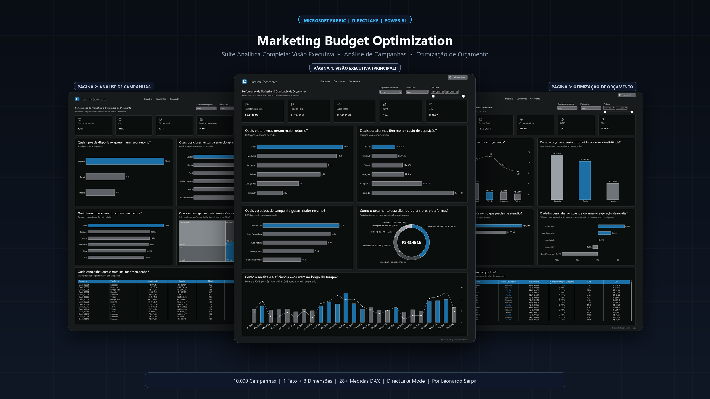
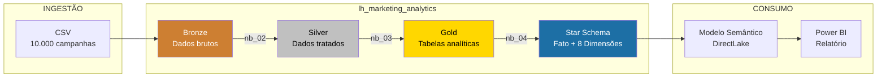
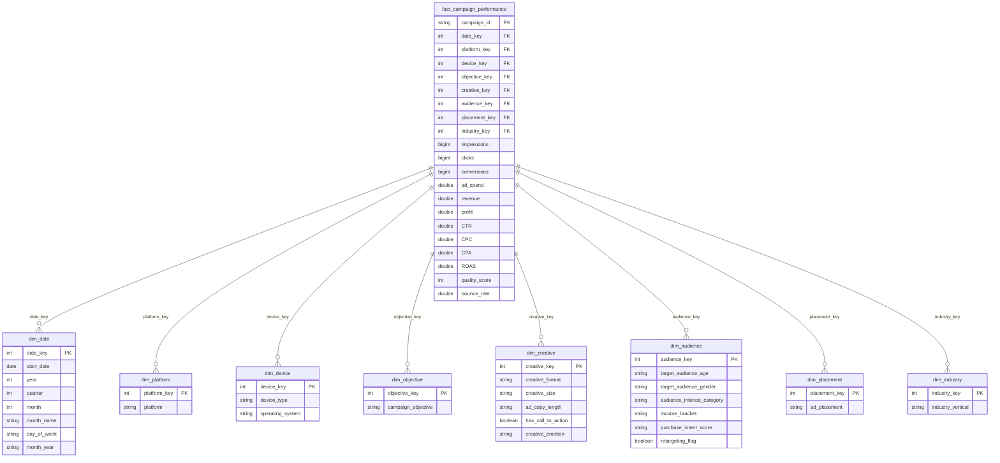
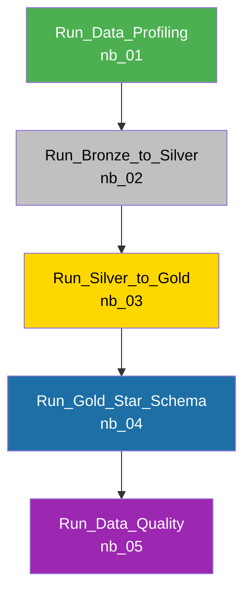

# Marketing Budget Optimization

> Projeto de análise e otimização de orçamento de marketing digital construído com **Microsoft Fabric**, utilizando arquitetura **Medallion**, modelagem **Star Schema**, modelo semântico **DirectLake** e relatório **Power BI**.

[Português](README.md) | [English](README.en.md)


<br>



---

## Demonstração do Projeto

> Demonstração prática do ambiente Microsoft Fabric e da navegação no relatório analítico do Power BI:


https://github.com/user-attachments/assets/4c8163b7-f431-4b8e-b378-c35c3f941402


---

## Visão Geral

Este projeto analisa **10.000 campanhas de marketing digital** em múltiplas plataformas para identificar oportunidades de otimização do investimento publicitário. O fluxo de dados percorre desde a ingestão bruta até a visualização em relatórios interativos, passando por etapas de qualidade, transformação e modelagem dimensional.

### Principais Entregas

- **Pipeline de dados** automatizado com orquestração sequencial
- **Modelo dimensional Star Schema** com 1 tabela fato e 8 dimensões
- **28+ medidas DAX** organizadas por categorias (Financeiro, Performance, Volume, Formatação)
- **Relatório Power BI** estruturado em 3 páginas analíticas (Executivo, Campanhas e Orçamento), cobrindo ROAS, CPA, alocação e recomendações de otimização
- **Framework de Data Quality** com testes automatizados e Quality Gate

---

## Arquitetura

O projeto segue a **Medallion Architecture** (Bronze → Silver → Gold), padrão recomendado pela Microsoft para projetos analíticos no Fabric.



---

## Estrutura do Repositório

```
fabric-marketing-budget-optimization-main/
│
├── README.md                                         # Documentação em português
├── README.en.md                                      # Documentação em inglês
├── LICENSE                                           # Licença MIT
├── data/                                             # Dados de entrada do projeto
│   └── tech_advertising_campaigns_dataset.csv       # Dataset original (10.000 registros)
│
├── fabric/                                           # Artefatos do Microsoft Fabric
│   ├── README.md (.en.md)                            # Guia técnico dos itens do Fabric (PT / EN)
│   ├── lakehouse/
│   │   └── lh_marketing_analytics.Lakehouse/         # Lakehouse centralizado
│   │
│   ├── notebooks/
│   │   ├── nb_01_data_profiling.Notebook/            # Profiling e análise exploratória
│   │   ├── nb_02_bronze_to_silver.Notebook/          # Transformação Bronze → Silver
│   │   ├── nb_03_silver_to_gold.Notebook/            # Agregações Silver → Gold
│   │   ├── nb_04_gold_star_schema.Notebook/          # Modelagem dimensional
│   │   └── nb_05_data_quality.Notebook/              # Framework de testes e Quality Gate
│   │
│   ├── pipelines/
│   │   └── pl_ingest_marketing_campaigns.DataPipeline/  # Pipeline de orquestração
│   │
│   ├── semantic_models/
│   │   └── sm_marketing_analytics.SemanticModel/     # Modelo semântico DirectLake
│   │
│   └── reports/
│       └── Marketing_Analytics_Budget_Optimization.Report/  # Relatório Power BI
│
└── docs/                                             # Documentação do projeto
    ├── README.md (.en.md)                            # Central e índice da documentação (PT / EN)
    ├── architecture.md (.en.md)                      # Guia de arquitetura (PT / EN)
    ├── data-dictionary.md (.en.md)                   # Dicionário de dados (PT / EN)
    ├── notebooks-guide.md (.en.md)                   # Guia dos notebooks (PT / EN)
    ├── semantic-model-guide.md (.en.md)              # Guia do modelo semântico (PT / EN)
    └── images/                                       # Evidências visuais e capturas de tela
        ├── cover.png (.en.png)                       # Banner de capa com mockup das 3 telas (PT / EN)
        ├── pipeline-fabric.jpg                       # Captura do Data Pipeline no Fabric
        ├── modelo-semantico.jpg                      # Diagrama do Modelo Semântico (Star Schema)
        └── relatorio-*.jpg                           # Capturas das 3 páginas do Power BI
```

---

## Dataset

| Atributo | Valor |
|:---|:---|
| **Arquivo** | `data/tech_advertising_campaigns_dataset.csv` |
| **Registros** | 10.000 campanhas |
| **Variáveis** | 41 colunas |
| **Granularidade** | 1 linha por campanha |
| **Domínio** | Marketing digital / Publicidade online |

### Principais Categorias de Campos

| Categoria | Campos |
|:---|:---|
| **Identificação** | `campaign_id`, `start_date`, `quarter`, `day_of_week`, `hour_of_day` |
| **Estratégia** | `campaign_objective`, `platform`, `ad_placement`, `budget_tier` |
| **Criativo** | `creative_format`, `creative_size`, `ad_copy_length`, `creative_emotion`, `has_call_to_action` |
| **Público** | `target_audience_age`, `target_audience_gender`, `audience_interest_category`, `income_bracket` |
| **Dispositivo** | `device_type`, `operating_system` |
| **Métricas Base** | `impressions`, `clicks`, `conversions`, `ad_spend`, `revenue` |
| **KPIs** | `CTR`, `CPC`, `conversion_rate`, `CPA`, `ROAS`, `profit` |
| **Comportamento** | `bounce_rate`, `avg_session_duration_seconds`, `pages_per_session`, `quality_score` |

---

## Modelo Dimensional (Star Schema)




---

## KPIs e Medidas DAX

### Financeiro

| Medida | Fórmula DAX | Formato |
|:---|:---|:---|
| **Investimento Total** | `SUM(fact[ad_spend])` | R$ #,0.00 |
| **Receita Total** | `SUM(fact[revenue])` | R$ #,0.00 |
| **Lucro Total** | `[Receita Total] - [Investimento Total]` | R$ #,0.00 |
| **Margem de Lucro** | `DIVIDE([Lucro Total], [Receita Total]) × 100` | 0.00 |
| **% Investimento** | `DIVIDE([Investimento Total], CALCULATE([Investimento Total], REMOVEFILTERS))` | % |
| **% Receita** | `DIVIDE([Receita Total], CALCULATE([Receita Total], REMOVEFILTERS))` | % |
| **Gap Alocação** | `[% Receita] - [% Investimento]` | % |

### Performance

| Medida | Fórmula DAX | Formato |
|:---|:---|:---|
| **ROAS** | `DIVIDE([Receita Total], [Investimento Total])` | #,0.00 |
| **CPA** | `DIVIDE([Investimento Total], [Conversões Totais])` | R$ #,0.00 |
| **CTR** | `DIVIDE([Cliques Totais], [Impressões Totais]) × 100` | 0.00 |
| **CPC** | `DIVIDE([Investimento Total], [Cliques Totais])` | R$ #,0.00 |
| **Taxa de Conversão** | `DIVIDE([Conversões Totais], [Cliques Totais]) × 100` | 0.00 |

### Volume

| Medida | Fórmula DAX | Formato |
|:---|:---|:---|
| **Impressões Totais** | `SUM(fact[impressions])` | #,0 |
| **Cliques Totais** | `SUM(fact[clicks])` | #,0 |
| **Conversões Totais** | `SUM(fact[conversions])` | #,0 |
| **Total de Campanhas** | `DISTINCTCOUNT(fact[campaign_id])` | #,0 |

### Coluna Calculada

| Nome | Lógica |
|:---|:---|
| **Status Orçamento** | Classifica cada campanha como **Escalar** (ROAS ≥ mediana e CPA ≤ mediana), **Reavaliar** (ROAS < mediana e CPA > mediana, ou sem conversões) ou **Manter** (demais casos) |

---

## Relatório Power BI

O relatório analítico foi desenvolvido no Power BI conectado ao Lakehouse via **DirectLake** (sem necessidade de agendamento de refresh). Ele está estruturado em **3 páginas analíticas** para atender desde a tomada de decisão estratégica até a operação tática de mídia:

### 1. Executivo
Visão macro de performance e eficiência financeira. Apresenta os KPIs consolidados (Investimento, Receita, Lucro, ROAS global de 6,54 e CPA), ranking de plataformas por maior retorno e menor custo de aquisição, retorno por objetivo de campanha, distribuição percentual de verba (gráfico de rosca) e a evolução temporal de receita versus eficiência mensal.


### 2. Campanhas
Diagnóstico tático detalhado dos vetores de conversão. Analisa os indicadores de engajamento (Taxa de Conversão de 4,30%, CTR, Cliques e Impressões), retorno por tipo de dispositivo (evidenciando a liderança de Desktop), posicionamento de anúncio (Sidebar e Stories), formatos de maior conversão (liderança de Vídeo), volumetria e eficiência por setor (E-commerce e SaaS via Treemap) e tabela analítica por campanha.


### 3. Orçamento
Painel de tomada de decisão e inteligência de alocação de verba. Cruza investimento versus ROAS por canal, categoriza o orçamento pelo status de eficiência (Reavaliar: R$ 19,5 Mi, Escalar: R$ 16,8 Mi e Manter: R$ 7,2 Mi), aponta onde está concentrado o orçamento que precisa de atenção e expõe o Gap de Alocação (desalinhamento entre participação no investimento e geração de receita por objetivo), com tabela de recomendação de ação direta por campanha.


---

## Pipeline de Dados

O pipeline `pl_ingest_marketing_campaigns` orquestra a execução sequencial dos notebooks:



Cada etapa depende do sucesso da anterior. Timeout configurado em 12 horas por atividade.


---

## Como Executar

### Pré-requisitos

- Workspace do **Microsoft Fabric** com capacidade ativa
- Permissões de **Contributor** ou superior no workspace

### Passo a Passo

1. **Importar o repositório** no workspace do Fabric via integração Git
2. **Upload do CSV** (`data/tech_advertising_campaigns_dataset.csv`) para a pasta `Files/bronze/raw/` do Lakehouse `lh_marketing_analytics`
3. **Executar o pipeline** `pl_ingest_marketing_campaigns` (executa todos os notebooks em sequência)
4. **Atualizar o modelo semântico** `sm_marketing_analytics`
5. **Acessar o relatório** `Marketing_Analytics_Budget_Optimization`

### Execução Manual (notebook por notebook)

```
nb_01_data_profiling      → Profiling dos dados brutos
nb_02_bronze_to_silver    → Tipagem + recálculo de métricas + regras de qualidade
nb_03_silver_to_gold      → Tabelas analíticas e agregações
nb_04_gold_star_schema    → Modelo dimensional (fato + dimensões)
nb_05_data_quality        → Framework de testes e Quality Gate
```

---

## Documentação

| Documento | Descrição |
|:---|:---|
| [Guia de Arquitetura](docs/architecture.md) | Decisões técnicas, justificativas e padrões adotados |
| [Dicionário de Dados](docs/data-dictionary.md) | Schema completo de todas as tabelas e medidas |
| [Guia dos Notebooks](docs/notebooks-guide.md) | Como executar e estender cada notebook |
| [Guia do Modelo Semântico](docs/semantic-model-guide.md) | Medidas DAX, padrões e extensibilidade |

---

## Licença

Este projeto está licenciado sob a [MIT License](LICENSE).
