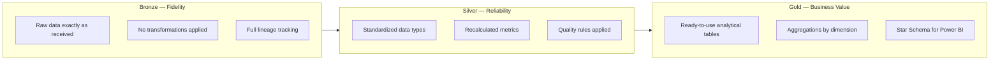
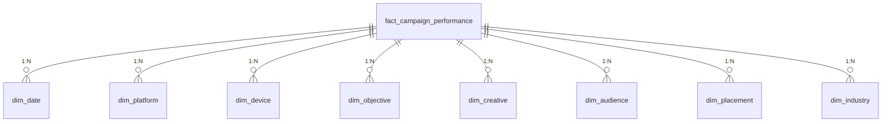
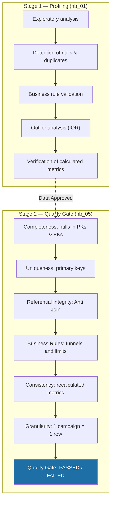
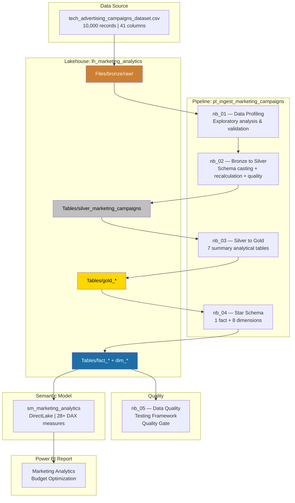

# Architecture Guide

> Technical explanation of the architectural decisions made in the Marketing Budget Optimization project.

[Português](architecture.md) | [English](architecture.en.md)

---

## 1. Why Medallion Architecture?

The **Medallion Architecture** (Bronze → Silver → Gold) was chosen because it is the recommended pattern by Microsoft for analytical projects in Fabric, offering concrete advantages for this project:

### Separation of Concerns



### Specific Project Benefits

| Decision | Justification |
|:---|:---|
| **Bronze preserves the original CSV** | Allows data reprocessing without requiring new ingestion |
| **Silver recalculates all metrics** | Ensures consistency without relying on formulas from the original dataset |
| **Gold separates analytical tables from the dimensional model** | `nb_03` generates exploratory aggregations; `nb_04` generates the optimized Star Schema for Power BI |

### Why not a direct approach (CSV → Power BI)?

While it might seem simpler, directly importing the CSV into Power BI would eliminate:

- Quality validation before analysis
- Traceability of transformations
- The ability to perform incremental reprocessing
- DirectLake mode (which requires Delta tables in the Lakehouse)

---

## 2. Why Star Schema?

The dimensional model was chosen over a single denormalized table for three main reasons:

### 2.1 VertiPaq Engine Optimization

Power BI uses the **VertiPaq** engine, which compresses data column by column. Dimensional tables with low cardinality (6 platforms, 5 objectives, 3 devices) compress significantly better than a flat table containing repeated text columns across 10,000 rows.

### 2.2 Multidimensional Filtering

The Star Schema allows filters in Power BI to propagate from any dimension to the fact table. A slicer for `dim_platform` automatically filters all measures without requiring additional context manipulation.

### 2.3 Maintainability

Adding a new dimension (e.g., `dim_region`) requires only:
1. Creating the table in notebook `nb_04`
2. Adding the foreign key (FK) to the fact table
3. Registering the relationship in the semantic model



### Discarded Alternative: Snowflake Schema

Normalizing dimensions into sub-dimensions (e.g., separating `operating_system` from `dim_device`) was unnecessary because:
- The data volume (10,000 records) does not justify the added complexity
- Dimensions with 2-7 attributes do not benefit from extra normalization
- DirectLake efficiently handles this data scale

---

## 3. Data Quality Strategy

Data quality is enforced in **two complementary stages**:



### Why two stages?

| Aspect | Profiling (nb_01) | Quality Gate (nb_05) |
|:---|:---|:---|
| **When it runs** | Before transformations | After the Star Schema |
| **Goal** | Understand raw data | Validate the final model |
| **Output** | Textual findings in notebook | Audit log persisted in Delta |
| **Blocking** | No (informative) | Yes (CRITICAL / WARNING) |

### Testing Framework (nb_05)

Each test logs:
- **test_id**: Unique identifier (e.g., `DQ-NUL-DATE_KEY`)
- **category**: Completeness, Uniqueness, Referential Integrity, Business Rule, Consistency
- **severity**: `CRITICAL` (blocks execution) or `WARNING` (alert only)
- **execution_date**: Timestamp for traceability

---

## 4. DirectLake Semantic Model

### What is DirectLake?

DirectLake is Power BI's highest-performing connection mode in Fabric. Unlike Import (which copies data into the model) and DirectQuery (which queries the source on every interaction), DirectLake **reads directly from Parquet/Delta files** in the Lakehouse with no data refresh required.

### Semantic Model Decisions

| Decision | Justification |
|:---|:---|
| **DAX Measures instead of Calculated Columns** | 12 out of 28 measures are aggregated metrics (SUM, DIVIDE) that must evaluate dynamically based on the filter context, not at the row level. |
| **Calculated Column `Status Orçamento`** | Justified exception: Must exist as a column to serve as a slicer/filter in the report. |
| **Hidden KPI columns in fact table** | Base columns for CTR, CPC, CPA, ROAS, and profit are hidden because DAX measures dynamically and accurately recalculate these values based on filter context. |
| **Color formatting measures in separate folder** | The 12 conditional formatting measures are kept in a dedicated "Formatting" folder to keep the analytical measures list clean. |
| **Dedicated `_Medidas` table** | Centralizes all measures in an empty calculated table (`{ BLANK() }`), following industry best practices. |

### Conditional Formatting Pattern

Color formatting measures follow a consistent pattern:

```
Best performance   → #1D6FA5 (Blue)
Other values       → #5F6368 (Grey)
```

For gradient rankings (e.g., `Cor Investimento Plataforma`):

```
Rank 1 → #1D6FA5 (Blue)
Rank 2 → #40454B
Rank 3 → #5C6268
Rank 4 → #787E84
Rank 5 → #969BA0
Rank 6 → #B8BCC0 (Light Grey)
```

---

## 5. Metric Standardization Pattern

### Why Recalculate KPIs at Each Layer?

The original dataset already contains columns like CTR, CPC, CPA, ROAS, and profit. However, **all metrics are recalculated** across three checkpoints:

1. **Notebook 01 (Profiling)** — To validate if original values are correct.
2. **Notebook 02 (Bronze → Silver)** — To ensure consistency in the Silver layer.
3. **Semantic Model (DAX)** — To compute accurately within Power BI's filter context.

### The Problem with Averaging Ratios

If Power BI simply summed the `CTR` column from the fact table, the result would be the **sum of individual CTRs**, rather than the true aggregate CTR. A DAX measure solves this:

```dax
-- ❌ INCORRECT: Summing individual campaign CTRs
SUM(fact[CTR])

-- ✅ CORRECT: Recalculating dynamically based on volumes
DIVIDE(
    SUM(fact[clicks]),
    SUM(fact[impressions])
) * 100
```

---

## 6. Outlier Handling

### Decision: Preserve Outliers

Data profiling (nb_01) identified extreme values via the IQR method across metrics like ROAS, CPA, revenue, and profit. The decision was made **not to remove** these records. Justification:

> Inspection of the corresponding campaigns demonstrated that these values align with realistic relationships between investment, revenue, conversions, and volume. They represent campaigns with exceptionally high investment generating high returns (or vice versa), rather than data anomalies.

### When to Remove Outliers?

In future extensions of this project, removal would be justified if:

- Outliers were caused by **ingestion errors** (e.g., duplicate rows, wrong units).
- The goal was **predictive modeling** (Machine Learning), where outliers can skew algorithm training.
- The analysis required strict **confidence intervals**, where extreme values compromise interpretation.

---

## 7. Complete Architecture Diagram




