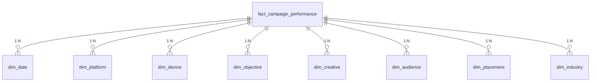
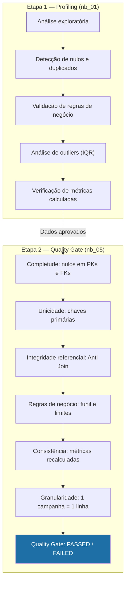
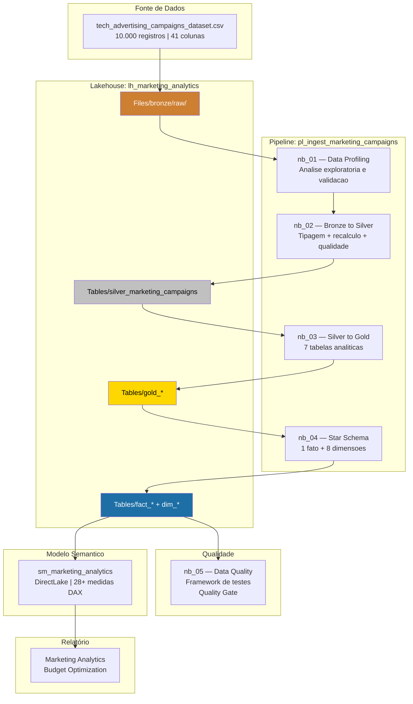

# Guia de Arquitetura

> Documento de explicação técnica sobre as decisões arquiteturais do projeto Marketing Budget Optimization.

[Português](architecture.md) | [English](architecture.en.md)

---

## 1. Por que Medallion Architecture?

A **Medallion Architecture** (Bronze → Silver → Gold) foi escolhida por ser o padrão recomendado pela Microsoft para projetos analíticos no Fabric e por oferecer vantagens concretas para este projeto:

### Separação de Responsabilidades

```mermaid
flowchart LR
    subgraph Bronze["Bronze — Fidelidade"]
        B1["Dados brutos exatamente como recebidos"]
        B2["Nenhuma transformacao aplicada"]
        B3["Rastreabilidade total da origem"]
    end

    subgraph Silver["Silver — Confiabilidade"]
        S1["Tipos de dados padronizados"]
        S2["Métricas recalculadas"]
        S3["Regras de qualidade aplicadas"]
    end

    subgraph Gold["Gold — Valor de Negocio"]
        G1["Tabelas analíticas prontas"]
        G2["Agregações por dimensão"]
        G3["Star Schema para Power BI"]
    end

    Bronze --> Silver --> Gold
```



### Benefícios Específicos para o Projeto

| Decisão | Justificativa |
|:---|:---|
| **Bronze preserva o CSV original** | Permite reprocessar dados sem precisar de nova ingestão |
| **Silver recalcula todas as métricas** | Garante consistência sem depender de fórmulas do dataset original |
| **Gold separa tabelas analíticas do modelo dimensional** | O `nb_03` gera agregações exploratórias; o `nb_04` gera o Star Schema otimizado para Power BI |

### Por que não uma abordagem direta (CSV → Power BI)?

Embora pareça mais simples, importar o CSV diretamente no Power BI eliminaria:

- A validação de qualidade antes da análise
- A rastreabilidade de transformações
- A possibilidade de reprocessamento incremental
- O modo DirectLake (que exige tabelas Delta no Lakehouse)

---

## 2. Por que Star Schema?

O modelo dimensional foi escolhido em vez de uma tabela desnormalizada única por três motivos principais:

### 2.1 Otimização do Motor VertiPaq

O Power BI usa o motor **VertiPaq**, que comprime dados por coluna. Tabelas dimensionais com baixa cardinalidade (6 plataformas, 5 objetivos, 3 dispositivos) comprimem significativamente melhor do que uma tabela flat com colunas de texto repetidas em 10.000 linhas.

### 2.2 Filtros Multidimensionais

O Star Schema permite que filtros no Power BI propaguem de qualquer dimensão para a tabela fato. Um slicer de `dim_platform` filtra automaticamente todas as medidas sem precisar de contextos adicionais.

### 2.3 Manutenibilidade

Adicionar uma nova dimensão (ex: `dim_region`) requer apenas:
1. Criar a tabela no notebook `nb_04`
2. Adicionar a FK na tabela fato
3. Registrar o relacionamento no modelo semântico



### Alternativa Descartada: Snowflake Schema

Não foi necessário normalizar dimensões em subdimensões (ex: separar `operating_system` de `dim_device`) porque:
- O volume de dados (10.000 registros) não justifica a complexidade adicional
- Dimensões com 2-7 atributos não se beneficiam de normalização extra
- O DirectLake já lida eficientemente com essa volumetria

---

## 3. Estratégia de Qualidade de Dados

A qualidade é aplicada em **duas etapas complementares**:



### Por que duas etapas?

| Aspecto | Profiling (nb_01) | Quality Gate (nb_05) |
|:---|:---|:---|
| **Quando executa** | Antes das transformações | Depois do Star Schema |
| **Objetivo** | Entender os dados brutos | Validar o modelo final |
| **Output** | Conclusões textuais no notebook | Log de auditoria persistido em Delta |
| **Bloqueante** | Não (informativo) | Sim (CRITICAL / WARNING) |

### Framework de Testes (nb_05)

Cada teste registra:
- **test_id**: Identificador único (ex: `DQ-NUL-DATE_KEY`)
- **categoria**: Completude, Unicidade, Integridade Referencial, Regra de Negócio, Consistência
- **severidade**: `CRITICAL` (bloqueia) ou `WARNING` (alerta)
- **data_execucao**: Timestamp para rastreabilidade

---

## 4. Modelo Semântico DirectLake

### O que é DirectLake?

DirectLake é o modo de conexão mais performático do Power BI no Fabric. Diferentemente do Import (que copia dados para o modelo) e do DirectQuery (que consulta a cada interação), o DirectLake **lê diretamente dos arquivos Parquet/Delta** no Lakehouse sem necessidade de refresh.

### Decisões no Modelo Semântico

| Decisão | Justificativa |
|:---|:---|
| **Medidas DAX em vez de colunas calculadas** | 12 das 28 medidas são métricas agregadas (SUM, DIVIDE) que devem ser avaliadas no contexto de filtro, não em nível de linha |
| **Coluna calculada `Status Orçamento`** | Exceção justificada: precisa existir como coluna para funcionar como filtro/slicer no relatório |
| **Colunas de KPI ocultas na fato** | CTR, CPC, CPA, ROAS e profit da fato são ocultos porque as medidas DAX recalculam esses valores de forma mais precisa no contexto de filtro |
| **Medidas de cor em pasta separada** | As 12 medidas de formatação condicional ficam na pasta "Formatação" para não poluir a lista de medidas analíticas |
| **Tabela `_Medidas` dedicada** | Centraliza todas as medidas em uma tabela calculada (`{ BLANK() }`) seguindo a convenção de mercado |

### Padrão de Formatação Condicional

As medidas de cor seguem um padrão consistente:

```
Melhor desempenho  → #1D6FA5 (Azul)
Demais valores     → #5F6368 (Cinza)
```

Para rankings com gradiente (ex: `Cor Investimento Plataforma`):

```
Ranking 1 → #1D6FA5 (Azul)
Ranking 2 → #40454B
Ranking 3 → #5C6268
Ranking 4 → #787E84
Ranking 5 → #969BA0
Ranking 6 → #B8BCC0 (Cinza claro)
```

---

## 5. Padrão de Métricas

### Por que Recalcular KPIs em Cada Camada?

O dataset original já contém colunas como CTR, CPC, CPA, ROAS e profit. Mesmo assim, **todas as métricas são recalculadas** em três pontos:

1. **Notebook 01 (Profiling)** — Para validar se os valores originais estão corretos
2. **Notebook 02 (Bronze → Silver)** — Para garantir consistência na camada Silver
3. **Modelo Semântico (DAX)** — Para calcular corretamente no contexto de filtro do Power BI

### O Problema das Médias de Taxas

Se o Power BI simplesmente somasse a coluna `CTR` da tabela fato, o resultado seria a **soma dos CTRs individuais**, não o CTR agregado real. A medida DAX resolve isso:

```dax
-- ❌ ERRADO: Somar CTR de cada campanha
SUM(fact[CTR])

-- ✅ CORRETO: Recalcular a partir dos volumes
DIVIDE(
    SUM(fact[clicks]),
    SUM(fact[impressions])
) * 100
```

---

## 6. Tratamento de Outliers

### Decisão: Preservar Outliers

O profiling (nb_01) identificou valores extremos via método IQR em métricas como ROAS, CPA, revenue e profit. A decisão foi **não remover** esses registros. Justificativa:

> A inspeção das campanhas correspondentes demonstrou que esses valores são compatíveis com as relações entre investimento, receita, conversões e volume. São campanhas com alto investimento gerando alto retorno (ou o oposto), não anomalias de dados.

### Quando Remover Outliers?

Em projetos futuros ou extensões deste projeto, a remoção seria justificada se:

- Os outliers fossem causados por **erros de ingestão** (ex: valores duplicados, unidade errada)
- O objetivo fosse **modelagem preditiva** (ML), onde outliers podem distorcer o treinamento
- A análise exigisse **intervalos de confiança** onde extremos comprometem a interpretação

---

## 7. Diagrama Completo da Arquitetura




