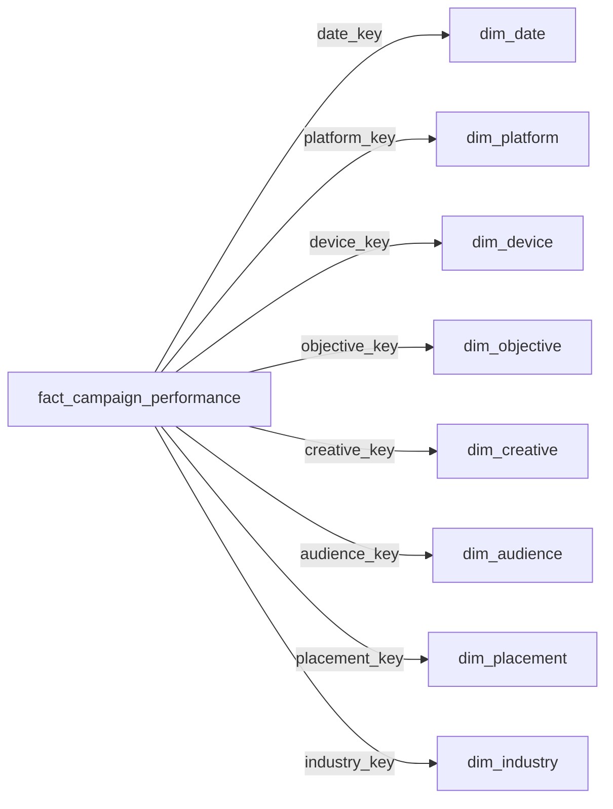

# Data Dictionary

> Complete reference for all tables, fields, types, and measures of the Marketing Budget Optimization project.

[Português](data-dictionary.md) | [English](data-dictionary.en.md)

---

## 1. Raw Dataset (Bronze Layer)

**File:** `data/tech_advertising_campaigns_dataset.csv`  
**Records:** 10,000 | **Columns:** 41

### 1.1 Identification & Temporal

| Field | Type | Description |
|:---|:---|:---|
| `campaign_id` | String | Unique campaign identifier |
| `start_date` | Date | Campaign start date |
| `quarter` | Integer | Quarter (1-4) |
| `day_of_week` | String | Day of the week (Monday, Tuesday, ...) |
| `hour_of_day` | Integer | Hour of the day (0-23) |
| `campaign_day` | Integer | Running day of the campaign |

### 1.2 Campaign Strategy

| Field | Type | Description | Values |
|:---|:---|:---|:---|
| `campaign_objective` | String | Campaign objective | Brand Awareness, Lead Generation, Sales, App Install, Website Traffic |
| `platform` | String | Advertising platform | Google Ads, Facebook, Instagram, LinkedIn, Twitter, TikTok |
| `ad_placement` | String | Ad placement | Feed, Stories, Search, Display, Sidebar, Video |
| `industry_vertical` | String | Industry vertical | Technology, Healthcare, Finance, E-commerce, Education, Entertainment |
| `budget_tier` | String | Budget tier | Low, Medium, High |

### 1.3 Creative

| Field | Type | Description | Values |
|:---|:---|:---|:---|
| `creative_format` | String | Creative format | Image, Video, Carousel, Text, Rich Media, Interactive |
| `creative_size` | String | Creative size | Small, Medium, Large |
| `ad_copy_length` | String | Ad copy length | Short, Medium, Long |
| `has_call_to_action` | Boolean | Has CTA (call-to-action) | True / False |
| `creative_emotion` | String | Creative emotion | Excitement, Trust, Fear, Humor, Inspiration, Urgency |
| `creative_age_days` | Integer | Creative age in days | 0+ |

### 1.4 Target Audience

| Field | Type | Description | Values |
|:---|:---|:---|:---|
| `target_audience_age` | String | Audience age bracket | 18-24, 25-34, 35-44, 45-54, 55-64, 65+ |
| `target_audience_gender` | String | Audience gender | Male, Female, All |
| `audience_interest_category` | String | Interest category | Technology, Sports, Fashion, Travel, Food, Gaming |
| `income_bracket` | String | Income bracket | Low, Middle, High, Premium |
| `purchase_intent_score` | String | Purchase intent (ordinal) | Low, Medium, High |
| `retargeting_flag` | Boolean | Retargeting campaign | True / False |

### 1.5 Device

| Field | Type | Description | Values |
|:---|:---|:---|:---|
| `device_type` | String | Device type | Desktop, Mobile, Tablet |
| `operating_system` | String | Operating system | Windows, macOS, iOS, Android, Linux, Other |

### 1.6 Baseline Metrics

| Field | Type | Description | Unit |
|:---|:---|:---|:---|
| `impressions` | Long | Total impressions | Count |
| `clicks` | Long | Total clicks | Count |
| `conversions` | Long | Total conversions | Count |
| `ad_spend` | Double | Advertising spend | USD ($) |
| `revenue` | Double | Generated revenue | USD ($) |

### 1.7 Derived KPIs

| Field | Type | Formula | Unit |
|:---|:---|:---|:---|
| `CTR` | Double | `(clicks / impressions) × 100` | % |
| `CPC` | Double | `ad_spend / clicks` | USD ($) |
| `conversion_rate` | Double | `(conversions / clicks) × 100` | % |
| `CPA` | Double | `ad_spend / conversions` | USD ($) |
| `ROAS` | Double | `revenue / ad_spend` | Ratio |
| `profit` | Double | `revenue - ad_spend` | USD ($) |
| `actual_cpc` | Double | Actual CPC (effective cost per click) | USD ($) |

### 1.8 User Behavior

| Field | Type | Description | Unit |
|:---|:---|:---|:---|
| `quality_score` | Integer | Ad quality score | 1-10 |
| `bounce_rate` | Double | Bounce rate | % (0-100) |
| `avg_session_duration_seconds` | Integer | Average session duration | Seconds |
| `pages_per_session` | Double | Pages per session | Count |

---

## 2. Silver Table

**Name:** `silver_marketing_campaigns`  
**Records:** 10,000 | **Format:** Delta Lake

### Applied Transformations (nb_02)

| Transformation | Affected Fields | Detail |
|:---|:---|:---|
| **Casting** | `campaign_id` → String, `start_date` → Date, `quarter/hour_of_day/campaign_day` → Integer, `quality_score` → Integer, `impressions/clicks/conversions` → Long, `ad_spend/revenue` → Double | Explicit types instead of inferred |
| **Metric recalculation** | CTR, CPC, conversion_rate, CPA, ROAS, profit | Recalculated from base metrics with divide-by-zero handling |
| **Quality rules** | All records | Filter: campaign_id NOT NULL, impressions/clicks/conversions/ad_spend/revenue ≥ 0, clicks ≤ impressions, conversions ≤ clicks |

---

## 3. Gold Analytical Tables

### 3.1 Campaign Performance Table

**Name:** `gold_campaign_performance`  
**Records:** 10,000 | **Granularity:** 1 campaign per row

Contains all 36 selected columns from Silver: identification, strategy, creative, audience, quality, baseline metrics, and KPIs.

### 3.2 Aggregated Tables

All tables below follow the same metrics schema:

| Column | Type | Description |
|:---|:---|:---|
| `[dimension]` | String | Grouping dimension value |
| `total_campaigns` | Long | Total campaigns |
| `total_impressions` | Long | Sum of impressions |
| `total_clicks` | Long | Sum of clicks |
| `total_conversions` | Long | Sum of conversions |
| `total_ad_spend` | Double | Sum of ad spend |
| `total_revenue` | Double | Sum of revenue |
| `CTR` | Double | `(total_clicks / total_impressions) × 100` |
| `CPC` | Double | `total_ad_spend / total_clicks` |
| `conversion_rate` | Double | `(total_conversions / total_clicks) × 100` |
| `CPA` | Double | `total_ad_spend / total_conversions` |
| `ROAS` | Double | `total_revenue / total_ad_spend` |
| `profit` | Double | `total_revenue - total_ad_spend` |

| Table | Dimension | Records |
|:---|:---|:---|
| `gold_platform_performance` | `platform` | 6 |
| `gold_objective_performance` | `campaign_objective` | 5 |
| `gold_device_performance` | `device_type` | 3 |
| `gold_creative_performance` | `creative_format` | 6 |
| `gold_placement_performance` | `ad_placement` | 6 |
| `gold_audience_performance` | `audience_interest_category` | 6 |

---

## 4. Star Schema (Dimensional Model)

### 4.1 Fact Table

**Name:** `fact_campaign_performance`  
**Records:** 10,000 | **Mode:** DirectLake

| Field | Type | Role | Visible in PBI |
|:---|:---|:---|:---|
| `campaign_id` | String | PK / Identifier | Yes |
| `date_key` | Int64 | FK → dim_date | — |
| `platform_key` | Int64 | FK → dim_platform | Yes |
| `device_key` | Int64 | FK → dim_device | — |
| `objective_key` | Int64 | FK → dim_objective | — |
| `creative_key` | Int64 | FK → dim_creative | — |
| `audience_key` | Int64 | FK → dim_audience | — |
| `placement_key` | Int64 | FK → dim_placement | — |
| `industry_key` | Int64 | FK → dim_industry | — |
| `budget_tier` | String | Degenerate attribute | Yes |
| `hour_of_day` | Int64 | Degenerate attribute | Yes |
| `campaign_day` | Int64 | Degenerate attribute | Yes |
| `creative_age_days` | Int64 | Degenerate attribute | Yes |
| `quality_score` | Int64 | Quality metric | Yes |
| `bounce_rate` | Double | Behavior metric | Yes |
| `avg_session_duration_seconds` | Int64 | Behavior metric | Yes |
| `pages_per_session` | Double | Behavior metric | Yes |
| `impressions` | Int64 | Base metric | Yes |
| `clicks` | Int64 | Base metric | Yes |
| `conversions` | Int64 | Base metric | Yes |
| `ad_spend` | Double | Financial metric | Yes |
| `revenue` | Double | Financial metric | Yes |
| `CTR` | Double | KPI (hidden — use DAX measure) | — |
| `CPC` | Double | KPI (hidden — use DAX measure) | — |
| `conversion_rate` | Double | KPI (hidden — use DAX measure) | — |
| `CPA` | Double | KPI (hidden — use DAX measure) | — |
| `ROAS` | Double | KPI (hidden — use DAX measure) | — |
| `profit` | Double | KPI (hidden — use DAX measure) | — |
| `Status Orçamento` | String | DAX Calculated Column | Yes |

### 4.2 Dimensions

#### dim_date (Temporal)

| Field | Type | Description |
|:---|:---|:---|
| `date_key` | Int64 | Primary key (surrogate key) |
| `start_date` | DateTime | Full date (isKey) |
| `year` | Int64 | Year |
| `quarter` | Int64 | Quarter (1-4) |
| `month` | Int64 | Numeric month (1-12) |
| `month_name` | String | Month name (sortBy: month) |
| `day` | Int64 | Day of the month |
| `day_of_week` | String | Day of the week |
| `year_month` | Int64 | Numeric Year+Month (sortBy key) |
| `month_year` | String | Readable Month/Year (sortBy: year_month) |

#### dim_platform

| Field | Type | Description |
|:---|:---|:---|
| `platform_key` | Int64 | Primary key |
| `platform` | String | Platform name |

#### dim_device

| Field | Type | Description |
|:---|:---|:---|
| `device_key` | Int64 | Primary key |
| `device_type` | String | Device type |
| `operating_system` | String | Operating system |

#### dim_objective

| Field | Type | Description |
|:---|:---|:---|
| `objective_key` | Int64 | Primary key |
| `campaign_objective` | String | Campaign objective |

#### dim_creative

| Field | Type | Description |
|:---|:---|:---|
| `creative_key` | Int64 | Primary key |
| `creative_format` | String | Creative format |
| `creative_size` | String | Size |
| `ad_copy_length` | String | Copy length |
| `has_call_to_action` | Boolean | Has CTA |
| `creative_emotion` | String | Transmitted emotion |

#### dim_audience

| Field | Type | Description |
|:---|:---|:---|
| `audience_key` | Int64 | Primary key |
| `target_audience_age` | String | Age bracket |
| `target_audience_gender` | String | Gender |
| `audience_interest_category` | String | Interest category |
| `income_bracket` | String | Income bracket |
| `purchase_intent_score` | String | Purchase intent |
| `retargeting_flag` | Boolean | Retargeting flag |

#### dim_placement

| Field | Type | Description |
|:---|:---|:---|
| `placement_key` | Int64 | Primary key |
| `ad_placement` | String | Ad placement |

#### dim_industry

| Field | Type | Description |
|:---|:---|:---|
| `industry_key` | Int64 | Primary key |
| `industry_vertical` | String | Industry vertical |

---

## 5. Relationship Map

All relationships are:
- **Direction:** Fact → Dimension (Many-to-One)
- **Cardinality:** N:1
- **Mode:** DirectLake (no import/refresh)

---

## 6. DAX Measures Catalog

### 6.1 Financial

| Measure | Formula | Format |
|:---|:---|:---|
| `Investimento Total` | `SUM(fact[ad_spend])` | Currency (`R$ #,0.00`) |
| `Receita Total` | `SUM(fact[revenue])` | Currency (`R$ #,0.00`) |
| `Lucro Total` | `[Receita Total] - [Investimento Total]` | Currency (`R$ #,0.00`) |
| `Margem de Lucro` | `DIVIDE([Lucro Total], [Receita Total]) × 100` | Decimal (`0.00`) |
| `% Investimento` | `DIVIDE([Investimento Total], CALCULATE([Investimento Total], REMOVEFILTERS(dim_objective)))` | General |
| `% Receita` | `DIVIDE([Receita Total], CALCULATE([Receita Total], REMOVEFILTERS(dim_objective)))` | General |
| `Gap Alocação` | `[% Receita] - [% Investimento]` | General |
| `% Investimento por Campanha` | `DIVIDE([Investimento Total], CALCULATE([Investimento Total], REMOVEFILTERS(fact[campaign_id]), ...))` | General |

### 6.2 Performance

| Measure | Formula | Format |
|:---|:---|:---|
| `ROAS` | `DIVIDE([Receita Total], [Investimento Total], BLANK())` | Decimal (`#,0.00`) |
| `CPA` | `DIVIDE([Investimento Total], [Conversões Totais], BLANK())` | Currency (`R$ #,0.00`) |
| `CTR` | `DIVIDE([Cliques Totais], [Impressões Totais], 0) × 100` | Decimal (`0.00`) |
| `CPC` | `DIVIDE([Investimento Total], [Cliques Totais], 0)` | Currency (`R$ #,0.00`) |
| `Taxa de Conversão` | `DIVIDE([Conversões Totais], [Cliques Totais], 0) × 100` | Decimal (`0.00`) |

### 6.3 Volume

| Measure | Formula | Format |
|:---|:---|:---|
| `Impressões Totais` | `SUM(fact[impressions])` | Integer (`#,0`) |
| `Cliques Totais` | `SUM(fact[clicks])` | Integer (`#,0`) |
| `Conversões Totais` | `SUM(fact[conversions])` | Integer (`#,0`) |
| `Total de Campanhas` | `DISTINCTCOUNT(fact[campaign_id])` | Integer (`#,0`) |
| `Campanhas Totais` | `DISTINCTCOUNT(fact[campaign_id])` | Integer (`0`) |

### 6.4 Conditional Formatting

| Measure | Logic | Usage |
|:---|:---|:---|
| `Cor ROAS Plataforma` | Blue for highest ROAS among platforms | Platform charts |
| `Cor CPA Plataforma` | Blue for lowest CPA among platforms | Platform charts |
| `Cor Receita Eficiência` | Blue when period ROAS ≥ overall ROAS | Temporal efficiency chart |
| `Cor ROAS Objetivo` | Blue for highest ROAS among objectives | Objective charts |
| `Cor Investimento Plataforma` | Grey gradient by investment ranking | Investment chart |
| `Cor ROAS Dispositivo` | Blue for highest ROAS among devices | Device charts |
| `Cor ROAS Posicionamento` | Blue for highest ROAS among placements | Placement charts |
| `Cor Conversão Criativo` | Blue for highest conversion rate among formats | Creative charts |
| `Cor ROAS Indústria` | Gradient by ROAS ranking among industries | Industry charts |
| `Cor ROAS Tabela` | Blue for campaigns in top 10% ROAS (90th Percentile) | Detailed table |
| `Cor CPA Tabela` | Blue for campaigns in top 10% lowest CPA | Detailed table |
| `Cor Investimento por ROAS` | Blue for platform with highest ROAS | Investment × ROAS chart |
| `Cor Status Orçamento` | Blue = Scale, Grey = Maintain, Light Grey = Reevaluate | Status cards |
| `Cor Status Orçamento Tabela` | Blue = Scale, White = Maintain, Grey = Reevaluate | Table background |
| `Cor Gap Alocação` | Blue (Gap > 1%), Grey (Gap < -1%), Neutral (between) | Gap chart |
| `Cor Investimento Reavaliar` | Blue for platform with highest investment to reevaluate | Reevaluation cards |

### 6.5 Calculated Column

| Name | Table | Logic |
|:---|:---|:---|
| `Status Orçamento` | `fact_campaign_performance` | Compares campaign ROAS and CPA against global medians. **Scale:** ROAS ≥ median AND CPA ≤ median. **Reevaluate:** ROAS < median AND CPA > median, or zero conversions. **Maintain:** all other cases. |
