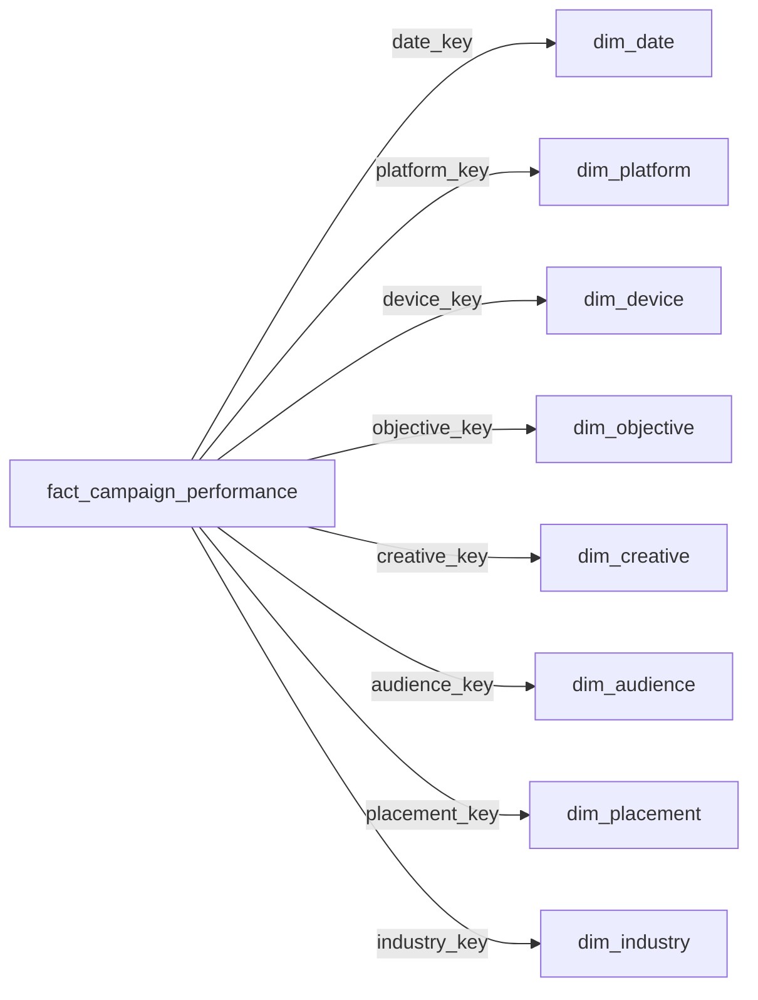

# Dicionário de Dados

> Referência completa de todas as tabelas, campos, tipos e medidas do projeto Marketing Budget Optimization.

[Português](data-dictionary.md) | [English](data-dictionary.en.md)

---

## 1. Dataset Bruto (Camada Bronze)

**Arquivo:** `data/tech_advertising_campaigns_dataset.csv`  
**Registros:** 10.000 | **Colunas:** 41

### 1.1 Identificação e Temporalidade

| Campo | Tipo | Descrição |
|:---|:---|:---|
| `campaign_id` | String | Identificador único da campanha |
| `start_date` | Date | Data de início da campanha |
| `quarter` | Integer | Trimestre (1-4) |
| `day_of_week` | String | Dia da semana (Monday, Tuesday, ...) |
| `hour_of_day` | Integer | Hora do dia (0-23) |
| `campaign_day` | Integer | Dia corrido da campanha |

### 1.2 Estratégia da Campanha

| Campo | Tipo | Descrição | Valores |
|:---|:---|:---|:---|
| `campaign_objective` | String | Objetivo da campanha | Brand Awareness, Lead Generation, Sales, App Install, Website Traffic |
| `platform` | String | Plataforma publicitária | Google Ads, Facebook, Instagram, LinkedIn, Twitter, TikTok |
| `ad_placement` | String | Posicionamento do anúncio | Feed, Stories, Search, Display, Sidebar, Video |
| `industry_vertical` | String | Vertical da indústria | Technology, Healthcare, Finance, E-commerce, Education, Entertainment |
| `budget_tier` | String | Faixa de orçamento | Low, Medium, High |

### 1.3 Criativo

| Campo | Tipo | Descrição | Valores |
|:---|:---|:---|:---|
| `creative_format` | String | Formato do criativo | Image, Video, Carousel, Text, Rich Media, Interactive |
| `creative_size` | String | Tamanho do criativo | Small, Medium, Large |
| `ad_copy_length` | String | Tamanho do texto do anúncio | Short, Medium, Long |
| `has_call_to_action` | Boolean | Possui CTA (call-to-action) | True / False |
| `creative_emotion` | String | Emoção do criativo | Excitement, Trust, Fear, Humor, Inspiration, Urgency |
| `creative_age_days` | Integer | Idade do criativo em dias | 0+ |

### 1.4 Público-Alvo

| Campo | Tipo | Descrição | Valores |
|:---|:---|:---|:---|
| `target_audience_age` | String | Faixa etária do público | 18-24, 25-34, 35-44, 45-54, 55-64, 65+ |
| `target_audience_gender` | String | Gênero do público | Male, Female, All |
| `audience_interest_category` | String | Categoria de interesse | Technology, Sports, Fashion, Travel, Food, Gaming |
| `income_bracket` | String | Faixa de renda | Low, Middle, High, Premium |
| `purchase_intent_score` | String | Intenção de compra (ordinal) | Low, Medium, High |
| `retargeting_flag` | Boolean | Campanha de retargeting | True / False |

### 1.5 Dispositivo

| Campo | Tipo | Descrição | Valores |
|:---|:---|:---|:---|
| `device_type` | String | Tipo de dispositivo | Desktop, Mobile, Tablet |
| `operating_system` | String | Sistema operacional | Windows, macOS, iOS, Android, Linux, Other |

### 1.6 Métricas Base

| Campo | Tipo | Descrição | Unidade |
|:---|:---|:---|:---|
| `impressions` | Long | Quantidade de impressões | Unidades |
| `clicks` | Long | Quantidade de cliques | Unidades |
| `conversions` | Long | Quantidade de conversões | Unidades |
| `ad_spend` | Double | Investimento publicitário | USD ($) |
| `revenue` | Double | Receita gerada | USD ($) |

### 1.7 KPIs Derivados

| Campo | Tipo | Fórmula | Unidade |
|:---|:---|:---|:---|
| `CTR` | Double | `(clicks / impressions) × 100` | % |
| `CPC` | Double | `ad_spend / clicks` | USD ($) |
| `conversion_rate` | Double | `(conversions / clicks) × 100` | % |
| `CPA` | Double | `ad_spend / conversions` | USD ($) |
| `ROAS` | Double | `revenue / ad_spend` | Razão |
| `profit` | Double | `revenue - ad_spend` | USD ($) |
| `actual_cpc` | Double | CPC real (custo por clique efetivo) | USD ($) |

### 1.8 Comportamento do Usuário

| Campo | Tipo | Descrição | Unidade |
|:---|:---|:---|:---|
| `quality_score` | Integer | Score de qualidade do anúncio | 1-10 |
| `bounce_rate` | Double | Taxa de rejeição | % (0-100) |
| `avg_session_duration_seconds` | Integer | Duração média da sessão | Segundos |
| `pages_per_session` | Double | Páginas por sessão | Unidades |

---

## 2. Tabela Silver

**Nome:** `silver_marketing_campaigns`  
**Registros:** 10.000 | **Formato:** Delta Lake

### Transformações Aplicadas (nb_02)

| Transformação | Campos Afetados | Detalhe |
|:---|:---|:---|
| **Tipagem** | `campaign_id` → String, `start_date` → Date, `quarter/hour_of_day/campaign_day` → Integer, `quality_score` → Integer, `impressions/clicks/conversions` → Long, `ad_spend/revenue` → Double | Tipos explícitos em vez de inferidos |
| **Recálculo de métricas** | CTR, CPC, conversion_rate, CPA, ROAS, profit | Recalculados a partir das métricas base com tratamento de divisão por zero |
| **Regras de qualidade** | Todos os registros | Filtro: campaign_id NOT NULL, impressions/clicks/conversions/ad_spend/revenue ≥ 0, clicks ≤ impressions, conversions ≤ clicks |

---

## 3. Tabelas Gold Analíticas

### 3.1 Tabela de Desempenho por Campanha

**Nome:** `gold_campaign_performance`  
**Registros:** 10.000 | **Granularidade:** 1 campanha por linha

Contém todas as 36 colunas selecionadas da Silver: identificação, estratégia, criativo, público, qualidade, métricas base e KPIs.

### 3.2 Tabelas Agregadas

Todas as tabelas abaixo seguem o mesmo schema de métricas:

| Coluna | Tipo | Descrição |
|:---|:---|:---|
| `[dimensão]` | String | Valor da dimensão de agrupamento |
| `total_campaigns` | Long | Total de campanhas |
| `total_impressions` | Long | Soma de impressões |
| `total_clicks` | Long | Soma de cliques |
| `total_conversions` | Long | Soma de conversões |
| `total_ad_spend` | Double | Soma do investimento |
| `total_revenue` | Double | Soma da receita |
| `CTR` | Double | `(total_clicks / total_impressions) × 100` |
| `CPC` | Double | `total_ad_spend / total_clicks` |
| `conversion_rate` | Double | `(total_conversions / total_clicks) × 100` |
| `CPA` | Double | `total_ad_spend / total_conversions` |
| `ROAS` | Double | `total_revenue / total_ad_spend` |
| `profit` | Double | `total_revenue - total_ad_spend` |

| Tabela | Dimensão | Registros |
|:---|:---|:---|
| `gold_platform_performance` | `platform` | 6 |
| `gold_objective_performance` | `campaign_objective` | 5 |
| `gold_device_performance` | `device_type` | 3 |
| `gold_creative_performance` | `creative_format` | 6 |
| `gold_placement_performance` | `ad_placement` | 6 |
| `gold_audience_performance` | `audience_interest_category` | 6 |

---

## 4. Star Schema (Modelo Dimensional)

### 4.1 Tabela Fato

**Nome:** `fact_campaign_performance`  
**Registros:** 10.000 | **Modo:** DirectLake

| Campo | Tipo | Papel | Visível no PBI |
|:---|:---|:---|:---|
| `campaign_id` | String | PK / Identificador | Sim |
| `date_key` | Int64 | FK → dim_date | — |
| `platform_key` | Int64 | FK → dim_platform | Sim |
| `device_key` | Int64 | FK → dim_device | — |
| `objective_key` | Int64 | FK → dim_objective | — |
| `creative_key` | Int64 | FK → dim_creative | — |
| `audience_key` | Int64 | FK → dim_audience | — |
| `placement_key` | Int64 | FK → dim_placement | — |
| `industry_key` | Int64 | FK → dim_industry | — |
| `budget_tier` | String | Atributo degenerado | Sim |
| `hour_of_day` | Int64 | Atributo degenerado | Sim |
| `campaign_day` | Int64 | Atributo degenerado | Sim |
| `creative_age_days` | Int64 | Atributo degenerado | Sim |
| `quality_score` | Int64 | Métrica de qualidade | Sim |
| `bounce_rate` | Double | Métrica de comportamento | Sim |
| `avg_session_duration_seconds` | Int64 | Métrica de comportamento | Sim |
| `pages_per_session` | Double | Métrica de comportamento | Sim |
| `impressions` | Int64 | Métrica base | Sim |
| `clicks` | Int64 | Métrica base | Sim |
| `conversions` | Int64 | Métrica base | Sim |
| `ad_spend` | Double | Métrica financeira | Sim |
| `revenue` | Double | Métrica financeira | Sim |
| `CTR` | Double | KPI (oculto — usar medida DAX) | — |
| `CPC` | Double | KPI (oculto — usar medida DAX) | — |
| `conversion_rate` | Double | KPI (oculto — usar medida DAX) | — |
| `CPA` | Double | KPI (oculto — usar medida DAX) | — |
| `ROAS` | Double | KPI (oculto — usar medida DAX) | — |
| `profit` | Double | KPI (oculto — usar medida DAX) | — |
| `Status Orçamento` | String | Coluna calculada DAX | Sim |

### 4.2 Dimensões

#### dim_date (Temporal)

| Campo | Tipo | Descrição |
|:---|:---|:---|
| `date_key` | Int64 | Chave primária (surrogate key) |
| `start_date` | DateTime | Data completa (isKey) |
| `year` | Int64 | Ano |
| `quarter` | Int64 | Trimestre (1-4) |
| `month` | Int64 | Mês numérico (1-12) |
| `month_name` | String | Nome do mês (sortBy: month) |
| `day` | Int64 | Dia do mês |
| `day_of_week` | String | Dia da semana |
| `year_month` | Int64 | Ano+mês numérico (sortBy key) |
| `month_year` | String | Mês/Ano legível (sortBy: year_month) |

#### dim_platform

| Campo | Tipo | Descrição |
|:---|:---|:---|
| `platform_key` | Int64 | Chave primária |
| `platform` | String | Nome da plataforma |

#### dim_device

| Campo | Tipo | Descrição |
|:---|:---|:---|
| `device_key` | Int64 | Chave primária |
| `device_type` | String | Tipo de dispositivo |
| `operating_system` | String | Sistema operacional |

#### dim_objective

| Campo | Tipo | Descrição |
|:---|:---|:---|
| `objective_key` | Int64 | Chave primária |
| `campaign_objective` | String | Objetivo da campanha |

#### dim_creative

| Campo | Tipo | Descrição |
|:---|:---|:---|
| `creative_key` | Int64 | Chave primária |
| `creative_format` | String | Formato do criativo |
| `creative_size` | String | Tamanho |
| `ad_copy_length` | String | Tamanho do texto |
| `has_call_to_action` | Boolean | Possui CTA |
| `creative_emotion` | String | Emoção transmitida |

#### dim_audience

| Campo | Tipo | Descrição |
|:---|:---|:---|
| `audience_key` | Int64 | Chave primária |
| `target_audience_age` | String | Faixa etária |
| `target_audience_gender` | String | Gênero |
| `audience_interest_category` | String | Categoria de interesse |
| `income_bracket` | String | Faixa de renda |
| `purchase_intent_score` | String | Intenção de compra |
| `retargeting_flag` | Boolean | Retargeting |

#### dim_placement

| Campo | Tipo | Descrição |
|:---|:---|:---|
| `placement_key` | Int64 | Chave primária |
| `ad_placement` | String | Posicionamento do anúncio |

#### dim_industry

| Campo | Tipo | Descrição |
|:---|:---|:---|
| `industry_key` | Int64 | Chave primária |
| `industry_vertical` | String | Vertical da indústria |

---

## 5. Mapa de Relacionamentos

Todos os relacionamentos são:
- **Direção:** Fato → Dimensão (Many-to-One)
- **Cardinalidade:** N:1
- **Modo:** DirectLake (sem import/refresh)

---

## 6. Catálogo de Medidas DAX

### 6.1 Financeiro

| Medida | Fórmula | Formato |
|:---|:---|:---|
| `Investimento Total` | `SUM(fact[ad_spend])` | R$ #,0.00 |
| `Receita Total` | `SUM(fact[revenue])` | R$ #,0.00 |
| `Lucro Total` | `[Receita Total] - [Investimento Total]` | R$ #,0.00 |
| `Margem de Lucro` | `DIVIDE([Lucro Total], [Receita Total]) × 100` | 0.00 |
| `% Investimento` | `DIVIDE([Investimento Total], CALCULATE([Investimento Total], REMOVEFILTERS(dim_objective)))` | Geral |
| `% Receita` | `DIVIDE([Receita Total], CALCULATE([Receita Total], REMOVEFILTERS(dim_objective)))` | Geral |
| `Gap Alocação` | `[% Receita] - [% Investimento]` | Geral |
| `% Investimento por Campanha` | `DIVIDE([Investimento Total], CALCULATE([Investimento Total], REMOVEFILTERS(fact[campaign_id]), ...))` | Geral |

### 6.2 Performance

| Medida | Fórmula | Formato |
|:---|:---|:---|
| `ROAS` | `DIVIDE([Receita Total], [Investimento Total], BLANK())` | #,0.00 |
| `CPA` | `DIVIDE([Investimento Total], [Conversões Totais], BLANK())` | R$ #,0.00 |
| `CTR` | `DIVIDE([Cliques Totais], [Impressões Totais], 0) × 100` | 0.00 |
| `CPC` | `DIVIDE([Investimento Total], [Cliques Totais], 0)` | R$ #,0.00 |
| `Taxa de Conversão` | `DIVIDE([Conversões Totais], [Cliques Totais], 0) × 100` | 0.00 |

### 6.3 Volume

| Medida | Fórmula | Formato |
|:---|:---|:---|
| `Impressões Totais` | `SUM(fact[impressions])` | #,0 |
| `Cliques Totais` | `SUM(fact[clicks])` | #,0 |
| `Conversões Totais` | `SUM(fact[conversions])` | #,0 |
| `Total de Campanhas` | `DISTINCTCOUNT(fact[campaign_id])` | #,0 |
| `Campanhas Totais` | `DISTINCTCOUNT(fact[campaign_id])` | 0 |

### 6.4 Formatação Condicional

| Medida | Lógica | Uso |
|:---|:---|:---|
| `Cor ROAS Plataforma` | Azul para maior ROAS entre plataformas | Gráficos por plataforma |
| `Cor CPA Plataforma` | Azul para menor CPA entre plataformas | Gráficos por plataforma |
| `Cor Receita Eficiência` | Azul quando ROAS do período ≥ ROAS geral | Gráfico de eficiência temporal |
| `Cor ROAS Objetivo` | Azul para maior ROAS entre objetivos | Gráficos por objetivo |
| `Cor Investimento Plataforma` | Gradiente de cinza por ranking de investimento | Gráfico de investimento |
| `Cor ROAS Dispositivo` | Azul para maior ROAS entre dispositivos | Gráficos por dispositivo |
| `Cor ROAS Posicionamento` | Azul para maior ROAS entre posicionamentos | Gráficos por posicionamento |
| `Cor Conversão Criativo` | Azul para maior taxa de conversão entre formatos | Gráficos por criativo |
| `Cor ROAS Indústria` | Gradiente por ranking de ROAS entre indústrias | Gráficos por indústria |
| `Cor ROAS Tabela` | Azul para campanhas no top 10% de ROAS (Percentil 90) | Tabela detalhada |
| `Cor CPA Tabela` | Azul para campanhas no top 10% menor CPA | Tabela detalhada |
| `Cor Investimento por ROAS` | Azul para plataforma com maior ROAS | Gráfico investimento × ROAS |
| `Cor Status Orçamento` | Azul = Escalar, Cinza = Manter, Cinza claro = Reavaliar | Cards de status |
| `Cor Status Orçamento Tabela` | Azul = Escalar, Branco = Manter, Cinza = Reavaliar | Fundo de tabela |
| `Cor Gap Alocação` | Azul (Gap > 1%), Cinza (Gap < -1%), Neutro (entre) | Gráfico de gap |
| `Cor Investimento Reavaliar` | Azul para plataforma com maior investimento a reavaliar | Cards de reavaliação |

### 6.5 Coluna Calculada

| Nome | Tabela | Lógica |
|:---|:---|:---|
| `Status Orçamento` | `fact_campaign_performance` | Compara ROAS e CPA da campanha contra as medianas globais. **Escalar:** ROAS ≥ mediana AND CPA ≤ mediana. **Reavaliar:** ROAS < mediana AND CPA > mediana, ou sem conversões. **Manter:** demais casos. |
