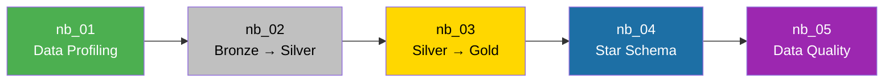

# Notebooks Guide

> How-to guide for executing, interpreting, and extending the notebooks of the Marketing Budget Optimization project.

[Português](notebooks-guide.md) | [English](notebooks-guide.en.md)

---

## Prerequisites

Before executing any notebook, ensure that:

- [ ] The **Microsoft Fabric** workspace has an active capacity (Trial or F-SKU)
- [ ] The Lakehouse `lh_marketing_analytics` has been created and attached
- [ ] The dataset file `data/tech_advertising_campaigns_dataset.csv` has been uploaded to the `Files/bronze/raw/` path in the Lakehouse
- [ ] You have **Contributor** or higher permissions in the workspace

---

## Workflow Overview



---

## NB 01 — Data Profiling

**File:** `nb_01_data_profiling.Notebook/notebook-content.py`  
**Layer:** Bronze  
**Goal:** Analyze the quality and consistency of raw data before transformations.

### What this notebook does

| Section | Description |
|:---|:---|
| **0. Imports** | Imports `pyspark.sql.functions` |
| **1. Overview** | Reads the CSV, displays sample, row/column count, and schema |
| **2. Quality** | Null analysis, duplicates, and `campaign_id` uniqueness |
| **3. Variables** | Cardinality, categorical domains, and numeric descriptive statistics |
| **4. Validation** | Business rules (negative values, funnels), recalculated vs. original metrics, outliers (IQR) |
| **5. Conclusions** | Textual assessment of data quality |

### How to execute

1. Open the notebook in the Fabric workspace
2. Ensure the Lakehouse `lh_marketing_analytics` is attached (sidebar)
3. Execute all cells in sequence (`Run All`)
4. Read the conclusions in section 5

### How to interpret results

- **Nulls = 0 across all fields:** Data is complete
- **Duplicates = 0:** No repeated records
- **Unique IDs = 10,000:** Every campaign has an exclusive identifier
- **Business rules = 0 violations:** Consistent funnel (impressions ≥ clicks ≥ conversions)
- **Metric divergences = 0:** Dataset KPIs are mathematically correct
- **Outliers identified:** Present, but contextually valid (do not remove)

### How to add new analyses

To add a new validation, insert a cell before section 5 following this pattern:

```python
# Your new analysis
result = df.filter(
    # your condition here
).count()

print(f"Result: {result:,}")
```

---

## NB 02 — Bronze to Silver

**File:** `nb_02_bronze_to_silver.Notebook/notebook-content.py`  
**Layer:** Bronze → Silver  
**Goal:** Transform raw data into a reliable and standardized table.

### What this notebook does

| Section | Description |
|:---|:---|
| **0. Imports** | Imports `functions` and `types` from PySpark |
| **1. Bronze Reading** | Reads CSV from `Files/bronze/raw/` |
| **2. Silver Preparation** | Explicit casting of 12 fields + recalculation of 6 metrics (CTR, CPC, conversion_rate, CPA, ROAS, profit) |
| **3. Quality Rules** | Filters invalid records (null IDs, negative values, inconsistent funnels) |
| **4. Silver Writing** | Persists as Delta table `silver_marketing_campaigns` |
| **5. Validation** | Compares volume between Bronze and Silver |
| **6. Conclusions** | Confirms preservation of 10,000 records |

### How to execute

1. Execute after `nb_01` (or directly if the CSV is already in the Lakehouse)
2. `Run All` — the notebook is idempotent (overwrite mode)
3. Validate that output shows `Lost records: 0`

### Casting Transformations

| Field | Original Type (Inferred) | Silver Type |
|:---|:---|:---|
| `campaign_id` | String/Integer | **StringType** |
| `start_date` | String | **DateType** |
| `quarter`, `hour_of_day`, `campaign_day` | Double | **IntegerType** |
| `quality_score` | Double | **IntegerType** |
| `impressions`, `clicks`, `conversions` | Integer | **LongType** |
| `ad_spend`, `revenue` | Double | **DoubleType** |

### Recalculation Formulas

```python
CTR             = (clicks / impressions) × 100      # when impressions > 0
CPC             = ad_spend / clicks                 # when clicks > 0
conversion_rate = (conversions / clicks) × 100      # when clicks > 0
CPA             = ad_spend / conversions            # when conversions > 0
ROAS            = revenue / ad_spend                # when ad_spend > 0
profit          = revenue - ad_spend                # always
```

Division by zero returns `0.0` for all metrics.

### How to add a new quality rule

Add the condition inside the `df_silver_final` filter (section 4):

```python
df_silver_final = df_silver.filter(
    # Existing rules...
    (F.col("clicks") <= F.col("impressions")) &
    (F.col("conversions") <= F.col("clicks")) &
    # ↓ Your new rule ↓
    (F.col("quality_score").between(1, 10))
)
```

---

## NB 03 — Silver to Gold

**File:** `nb_03_silver_to_gold.Notebook/notebook-content.py`  
**Layer:** Silver → Gold  
**Goal:** Build analytical tables for consumption by semantic model and Power BI.

### What this notebook does

| Section | Description |
|:---|:---|
| **0. Imports** | Imports `functions` from PySpark |
| **1. Silver Reading** | Reads the `silver_marketing_campaigns` table |
| **2.1** | `gold_campaign_performance` table — 36 columns, campaign granularity |
| **2.2** | `gold_platform_performance` table — aggregated by platform (6 records) |
| **2.3** | `gold_objective_performance` table — aggregated by objective (5 records) |
| **2.4** | Reusable function `criar_agregacao_gold(df, dimensao)` |
| **2.5** | Tables: `gold_device_performance`, `gold_creative_performance`, `gold_placement_performance`, `gold_audience_performance` |
| **3. Writing** | Persists 7 Gold tables in Delta format |
| **4. Validation** | Checks expected row count for each table |

### Function `criar_agregacao_gold`

This function is the core of aggregations. It takes a DataFrame and a dimension column name, returning a table with:

```
dimension | total_campaigns | total_impressions | total_clicks | total_conversions |
          | total_ad_spend  | total_revenue     | CTR | CPC | conversion_rate    |
          | CPA | ROAS | profit
```

### How to add a new aggregation

```python
# 1. Create aggregation using the existing function
gold_new_dimension = criar_agregacao_gold(
    df_silver,
    "column_name"    # e.g., "operating_system", "income_bracket"
)

# 2. Add to writing dictionary
tabelas_gold["gold_new_dimension_performance"] = gold_new_dimension

# 3. Add to validation
validacoes_gold["gold_new_dimension_performance"] = N  # expected record count
```

---

## NB 04 — Gold Star Schema

**File:** `nb_04_gold_star_schema.Notebook/notebook-content.py`  
**Layer:** Gold → Star Schema  
**Goal:** Build the dimensional model with 1 fact table and 8 dimensions.

### What this notebook does

1. Reads the `gold_campaign_performance` table
2. Creates **8 dimensional tables** with surrogate keys (sequential numeric keys)
3. Creates the **fact table** `fact_campaign_performance` with FKs and metrics
4. Validates referential integrity, uniqueness, and volumes
5. Persists all tables in Delta format

### Created Dimensions

| Dimension | Source Fields | Surrogate Key |
|:---|:---|:---|
| `dim_date` | start_date, quarter, day_of_week + derived fields (year, month, month_name, day, year_month, month_year) | `date_key` |
| `dim_platform` | platform | `platform_key` |
| `dim_device` | device_type, operating_system | `device_key` |
| `dim_objective` | campaign_objective | `objective_key` |
| `dim_creative` | creative_format, creative_size, ad_copy_length, has_call_to_action, creative_emotion | `creative_key` |
| `dim_audience` | target_audience_age, target_audience_gender, audience_interest_category, income_bracket, purchase_intent_score, retargeting_flag | `audience_key` |
| `dim_placement` | ad_placement | `placement_key` |
| `dim_industry` | industry_vertical | `industry_key` |

### How to add a new dimension

```python
# 1. Extract distinct values and generate surrogate key
dim_new = (
    gold_campaign_performance
    .select("field1", "field2")
    .distinct()
    .withColumn("new_key", F.monotonically_increasing_id() + 1)
)

# 2. Join to add FK to the fact table
fact = (
    fact
    .join(dim_new, on=["field1", "field2"], how="left")
    .drop("field1", "field2")
)

# 3. Persist as Delta
dim_new.write.format("delta").mode("overwrite").saveAsTable("dim_new")
```

---

## NB 05 — Data Quality

**File:** `nb_05_data_quality.ipynb`  
**Layer:** Gold → Audit  
**Goal:** Validate quality and integrity of the Star Schema with an automated testing framework.

### What this notebook does

| Section | Description |
|:---|:---|
| **0. Imports** | PySpark functions, types, datetime |
| **1. Reading** | Loads all 9 tables of the Star Schema |
| **2. Structure** | Displays schemas for fact and dimensions |
| **3. Framework** | Initializes `resultados_dq[]` array and `registrar_resultado()` function |
| **4. Completeness** | Tests nulls in dimension PKs and critical fact fields |
| **5. Uniqueness** | Tests duplicates in dimension PKs and fact `campaign_id` |
| **6. Integrity** | Anti Join of each fact FK against corresponding dimension PK |
| **7. Rules** | clicks ≤ impressions, conversions ≤ clicks, spend/revenue ≥ 0, quality_score [1-10], bounce_rate [0-100] |
| **8. Metrics** | Recalculates profit, ROAS, CTR, CPA and compares with table values |
| **9. Granularity** | Verifies that each campaign_id appears exactly 1 time in fact |
| **10. Consolidation** | Persists audit log as Delta table |
| **11. Quality Gate** | Final outcome: APPROVED / REJECTED |

### Severities

| Severity | Meaning | Examples |
|:---|:---|:---|
| `CRITICAL` | Blocks report publishing | Null in PK, orphan FK, duplicate record |
| `WARNING` | Alert, non-blocking | quality_score out of bounds, bounce_rate out of [0-100] |

### Quality Gate

The notebook finishes with a binary decision:
- **APPROVED:** Zero CRITICAL tests failed → model is production-ready
- **REJECTED:** At least 1 CRITICAL test failed → investigate before publishing

### How to add a new test

```python
# Example: validate creative_age_days is positive
creative_age_invalid = (
    fact
    .filter(F.col("creative_age_days") < 0)
    .count()
)

registrar_resultado(
    "DQ-REG-CREATIVE-AGE",             # Unique test ID
    "Business Rule",                   # Category
    "fact_campaign_performance",       # Table
    "creative_age_days must be >= 0",  # Rule
    total_fato,                        # Total records evaluated
    creative_age_invalid,              # Found failures
    severidade="WARNING"               # CRITICAL or WARNING
)
```

---

## Full Pipeline

### Execution via Pipeline (Recommended)

The pipeline `pl_ingest_marketing_campaigns` automatically executes notebooks 01-04 sequentially:

```
Run_Data_Profiling (nb_01) 
    → Run_Bronze_to_Silver (nb_02) 
        → Run_Silver_to_Gold (nb_03) 
            → Run_Gold_Star_Schema (nb_04)
```

**Note:** `nb_05` (Data Quality) is not included in the orchestration pipeline and should be executed manually post-pipeline, as it acts as an auditing validation point.

### Manual Execution

If you prefer executing notebook by notebook:

```
1. nb_01_data_profiling          → Read conclusions before proceeding
2. nb_02_bronze_to_silver        → Verify "Lost records: 0"
3. nb_03_silver_to_gold          → Verify row count validation
4. nb_04_gold_star_schema        → Verify referential integrity
5. nb_05_data_quality            → Quality Gate: APPROVED?
```

### Idempotency

All writing operations use `.mode("overwrite")`. Running the pipeline multiple times produces the exact same result without data duplication.
