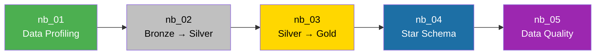

# Guia dos Notebooks

> How-to guide para execução, interpretação e extensão dos notebooks do projeto Marketing Budget Optimization.

[Português](notebooks-guide.md) | [English](notebooks-guide.en.md)

---

## Pré-requisitos

Antes de executar qualquer notebook, certifique-se de que:

- [ ] O workspace do **Microsoft Fabric** está com capacidade ativa
- [ ] O Lakehouse `lh_marketing_analytics` está criado e vinculado
- [ ] O arquivo `data/tech_advertising_campaigns_dataset.csv` foi enviado para a pasta `Files/bronze/raw/` do Lakehouse
- [ ] Você possui permissão de **Contributor** ou superior no workspace

---

## Visão Geral do Fluxo



---

## NB 01 — Data Profiling

**Arquivo:** `nb_01_data_profiling.Notebook/notebook-content.py`  
**Camada:** Bronze  
**Objetivo:** Analisar a qualidade e consistência dos dados brutos antes das transformações.

### O que este notebook faz

| Seção | Descrição |
|:---|:---|
| **0. Imports** | Importa `pyspark.sql.functions` |
| **1. Visão Geral** | Lê o CSV, exibe amostra, contagem de linhas/colunas e schema |
| **2. Qualidade** | Análise de nulos, duplicados e unicidade do `campaign_id` |
| **3. Variáveis** | Cardinalidade, domínios das categóricas e estatísticas descritivas das numéricas |
| **4. Validação** | Regras de negócio (valores negativos, funil), métricas recalculadas vs. originais, outliers (IQR) |
| **5. Conclusões** | Parecer textual sobre a qualidade dos dados |

### Como executar

1. Abra o notebook no workspace do Fabric
2. Verifique se o Lakehouse `lh_marketing_analytics` está vinculado (barra lateral)
3. Execute todas as células em sequência (`Run All`)
4. Leia as conclusões na seção 5

### Como interpretar os resultados

- **Nulos = 0 para todos os campos:** Os dados estão completos
- **Duplicados = 0:** Não há registros repetidos
- **IDs únicos = 10.000:** Cada campanha possui identificador exclusivo
- **Regras de negócio = 0 violações:** Funil consistente (impressões ≥ cliques ≥ conversões)
- **Divergências de métricas = 0:** Os KPIs do dataset estão matematicamente corretos
- **Outliers identificados:** Presentes, mas contextualmente válidos (não remover)

### Como adicionar novas análises

Para adicionar uma nova validação, insira uma célula antes da seção 5 seguindo o padrão:

```python
# Sua nova análise
resultado = df.filter(
    # sua condição aqui
).count()

print(f"Resultado: {resultado:,}")
```

---

## NB 02 — Bronze to Silver

**Arquivo:** `nb_02_bronze_to_silver.Notebook/notebook-content.py`  
**Camada:** Bronze → Silver  
**Objetivo:** Transformar os dados brutos em uma tabela confiável e padronizada.

### O que este notebook faz

| Seção | Descrição |
|:---|:---|
| **0. Imports** | Importa `functions` e `types` do PySpark |
| **1. Leitura Bronze** | Lê o CSV da pasta `Files/bronze/raw/` |
| **2. Preparação Silver** | Tipagem explícita de 12 campos + recálculo de 6 métricas (CTR, CPC, conversion_rate, CPA, ROAS, profit) |
| **3. Regras de Qualidade** | Filtra registros inválidos (IDs nulos, valores negativos, funil inconsistente) |
| **4. Gravação Silver** | Persiste como tabela Delta `silver_marketing_campaigns` |
| **5. Validação** | Compara volumetria Bronze vs. Silver |
| **6. Conclusões** | Confirmação da preservação dos 10.000 registros |

### Como executar

1. Execute após o `nb_01` (ou diretamente se o CSV já estiver no Lakehouse)
2. `Run All` — o notebook é idempotente (overwrite mode)
3. Valide que a saída mostra `Registros perdidos: 0`

### Transformações de Tipagem

| Campo | Tipo Original (Inferido) | Tipo Silver |
|:---|:---|:---|
| `campaign_id` | String/Integer | **StringType** |
| `start_date` | String | **DateType** |
| `quarter`, `hour_of_day`, `campaign_day` | Double | **IntegerType** |
| `quality_score` | Double | **IntegerType** |
| `impressions`, `clicks`, `conversions` | Integer | **LongType** |
| `ad_spend`, `revenue` | Double | **DoubleType** |

### Fórmulas de Recálculo

```python
CTR             = (clicks / impressions) × 100     # quando impressions > 0
CPC             = ad_spend / clicks                 # quando clicks > 0
conversion_rate = (conversions / clicks) × 100      # quando clicks > 0
CPA             = ad_spend / conversions            # quando conversions > 0
ROAS            = revenue / ad_spend                # quando ad_spend > 0
profit          = revenue - ad_spend                # sempre
```

Divisão por zero retorna `0.0` em todas as métricas.

### Como adicionar uma nova regra de qualidade

Adicione a condição no filtro de `df_silver_final` (seção 4):

```python
df_silver_final = df_silver.filter(
    # Regras existentes...
    (F.col("clicks") <= F.col("impressions")) &
    (F.col("conversions") <= F.col("clicks")) &
    # ↓ Sua nova regra ↓
    (F.col("quality_score").between(1, 10))
)
```

---

## NB 03 — Silver to Gold

**Arquivo:** `nb_03_silver_to_gold.Notebook/notebook-content.py`  
**Camada:** Silver → Gold  
**Objetivo:** Construir tabelas analíticas para consumo pelo modelo semântico e Power BI.

### O que este notebook faz

| Seção | Descrição |
|:---|:---|
| **0. Imports** | Importa `functions` do PySpark |
| **1. Leitura Silver** | Lê a tabela `silver_marketing_campaigns` |
| **2.1** | Tabela `gold_campaign_performance` — 36 colunas, granularidade de campanha |
| **2.2** | Tabela `gold_platform_performance` — agregada por plataforma (6 registros) |
| **2.3** | Tabela `gold_objective_performance` — agregada por objetivo (5 registros) |
| **2.4** | Função reutilizável `criar_agregacao_gold(df, dimensao)` |
| **2.5** | Tabelas: `gold_device_performance`, `gold_creative_performance`, `gold_placement_performance`, `gold_audience_performance` |
| **3. Gravação** | Persiste 7 tabelas Gold em formato Delta |
| **4. Validação** | Verifica contagem esperada de cada tabela |

### Função `criar_agregacao_gold`

Esta função é o coração das agregações. Ela recebe um DataFrame e o nome de uma coluna de dimensão, e retorna uma tabela com:

```
dimensao | total_campaigns | total_impressions | total_clicks | total_conversions |
         | total_ad_spend  | total_revenue     | CTR | CPC | conversion_rate   |
         | CPA | ROAS | profit
```

### Como adicionar uma nova agregação

```python
# 1. Crie a agregação usando a função existente
gold_nova_dimensao = criar_agregacao_gold(
    df_silver,
    "nome_da_coluna"    # ex: "operating_system", "income_bracket"
)

# 2. Adicione ao dicionário de gravação
tabelas_gold["gold_nova_dimensao_performance"] = gold_nova_dimensao

# 3. Adicione à validação
validacoes_gold["gold_nova_dimensao_performance"] = N  # número esperado de registros
```

---

## NB 04 — Gold Star Schema

**Arquivo:** `nb_04_gold_star_schema.Notebook/notebook-content.py`  
**Camada:** Gold → Star Schema  
**Objetivo:** Construir o modelo dimensional com 1 tabela fato e 8 dimensões.

### O que este notebook faz

1. Lê a tabela `gold_campaign_performance`
2. Cria **8 tabelas dimensionais** com surrogate keys (chaves numéricas sequenciais)
3. Cria a **tabela fato** `fact_campaign_performance` com as FKs e métricas
4. Valida integridade referencial, unicidade e volumetria
5. Persiste todas as tabelas em formato Delta

### Dimensões Criadas

| Dimensão | Campos Fonte | Surrogate Key |
|:---|:---|:---|
| `dim_date` | start_date, quarter, day_of_week + campos derivados (year, month, month_name, day, year_month, month_year) | `date_key` |
| `dim_platform` | platform | `platform_key` |
| `dim_device` | device_type, operating_system | `device_key` |
| `dim_objective` | campaign_objective | `objective_key` |
| `dim_creative` | creative_format, creative_size, ad_copy_length, has_call_to_action, creative_emotion | `creative_key` |
| `dim_audience` | target_audience_age, target_audience_gender, audience_interest_category, income_bracket, purchase_intent_score, retargeting_flag | `audience_key` |
| `dim_placement` | ad_placement | `placement_key` |
| `dim_industry` | industry_vertical | `industry_key` |

### Como adicionar uma nova dimensão

```python
# 1. Extrair valores distintos e gerar surrogate key
dim_nova = (
    gold_campaign_performance
    .select("campo1", "campo2")
    .distinct()
    .withColumn("nova_key", F.monotonically_increasing_id() + 1)
)

# 2. Fazer join para adicionar FK na fato
fact = (
    fact
    .join(dim_nova, on=["campo1", "campo2"], how="left")
    .drop("campo1", "campo2")
)

# 3. Persistir como Delta
dim_nova.write.format("delta").mode("overwrite").saveAsTable("dim_nova")
```

---

## NB 05 — Data Quality

**Arquivo:** `nb_05_data_quality.ipynb`  
**Camada:** Gold → Auditoria  
**Objetivo:** Validar a qualidade e integridade do Star Schema com um framework de testes automatizado.

### O que este notebook faz

| Seção | Descrição |
|:---|:---|
| **0. Imports** | PySpark functions, types, datetime |
| **1. Leitura** | Carrega todas as 9 tabelas do Star Schema |
| **2. Estrutura** | Exibe schemas da fato e dimensões |
| **3. Framework** | Inicializa `resultados_dq[]` e função `registrar_resultado()` |
| **4. Completude** | Testa nulos em PKs das dimensões e campos críticos da fato |
| **5. Unicidade** | Testa duplicatas em PKs das dimensões e `campaign_id` na fato |
| **6. Integridade** | Anti Join de cada FK da fato contra PK da dimensão correspondente |
| **7. Regras** | clicks ≤ impressions, conversions ≤ clicks, spend/revenue ≥ 0, quality_score [1-10], bounce_rate [0-100] |
| **8. Métricas** | Recalcula profit, ROAS, CTR, CPA e compara com valores da tabela |
| **9. Granularidade** | Verifica que cada campaign_id aparece exatamente 1 vez na fato |
| **10. Consolidação** | Persiste log de auditoria em tabela Delta |
| **11. Quality Gate** | Resultado final: APPROVED / REJECTED |

### Severidades

| Severidade | Significado | Exemplos |
|:---|:---|:---|
| `CRITICAL` | Bloqueia a publicação do relatório | Nulo em PK, FK órfã, duplicata |
| `WARNING` | Alerta, não bloqueia | quality_score fora do range, bounce_rate fora de [0-100] |

### Quality Gate

O notebook finaliza com uma decisão binária:
- **APPROVED:** Nenhum teste CRITICAL falhou → modelo pronto para produção
- **REJECTED:** Ao menos 1 teste CRITICAL falhou → investigar antes de publicar

### Como adicionar um novo teste

```python
# Exemplo: validar que creative_age_days é positivo
creative_age_invalidos = (
    fact
    .filter(F.col("creative_age_days") < 0)
    .count()
)

registrar_resultado(
    "DQ-REG-CREATIVE-AGE",           # ID único do teste
    "Regra de Negócio",               # Categoria
    "fact_campaign_performance",       # Tabela
    "creative_age_days deve ser >= 0", # Regra
    total_fato,                        # Total de registros avaliados
    creative_age_invalidos,            # Falhas encontradas
    severidade="WARNING"              # CRITICAL ou WARNING
)
```

---

## Pipeline Completo

### Execução via Pipeline (Recomendado)

O pipeline `pl_ingest_marketing_campaigns` executa automaticamente os notebooks 01-04 em sequência:

```
Run_Data_Profiling (nb_01) 
    → Run_Bronze_to_Silver (nb_02) 
        → Run_Silver_to_Gold (nb_03) 
            → Run_Gold_Star_Schema (nb_04)
```

**Nota:** O `nb_05` (Data Quality) não está incluído no pipeline e deve ser executado manualmente após o pipeline, pois ele é um ponto de validação/auditoria.

### Execução Manual

Se preferir executar notebook por notebook:

```
1. nb_01_data_profiling          → Leia as conclusões antes de prosseguir
2. nb_02_bronze_to_silver        → Verifique "Registros perdidos: 0"
3. nb_03_silver_to_gold          → Verifique validação de contagens
4. nb_04_gold_star_schema        → Verifique integridade referencial
5. nb_05_data_quality            → Quality Gate: APPROVED?
```

### Idempotência

Todos os notebooks usam `.mode("overwrite")`. Executar o pipeline múltiplas vezes produz o mesmo resultado, sem duplicação de dados.
