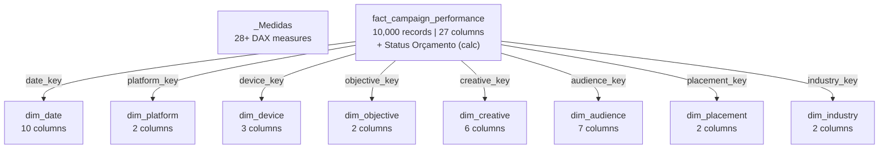
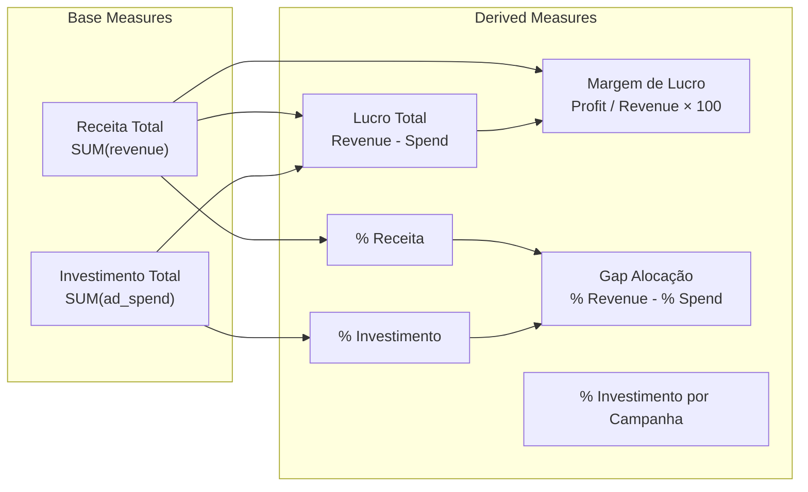
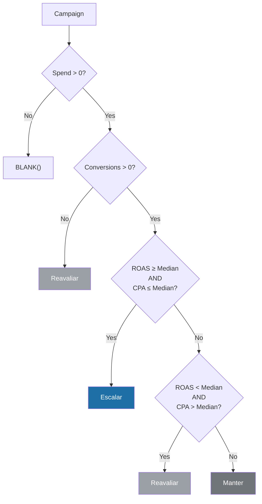

# Semantic Model and Power BI Guide

> How-to guide for understanding, maintaining, and extending the `sm_marketing_analytics` semantic model and the Power BI report.

[Português](semantic-model-guide.md) | [English](semantic-model-guide.en.md)

---

## 1. Semantic Model Structure

### Overview

| Attribute | Value |
|:---|:---|
| **Name** | `sm_marketing_analytics` |
| **Mode** | DirectLake |
| **Culture** | en-US |
| **Source** | Lakehouse `lh_marketing_analytics` via OneLake |
| **Tables** | 1 fact + 8 dimensions + 1 measure table |
| **Measures** | 28+ (organized into 4 folders) |
| **Definition Format** | TMDL (Tabular Model Definition Language) |

### DirectLake Connection

The model connects directly to Delta files in the Lakehouse with no import or refresh required:

```
AzureStorage.DataLake(
    "https://onelake.dfs.fabric.microsoft.com/<workspace-id>/<lakehouse-id>"
)
```

This means that:
- **There is no scheduled refresh** — data is read on demand
- **Changes in Delta tables** instantly reflect in the report
- **Performance** is superior to Import for frequently changing data

### Tables and Relationships Diagram




---

## 2. Measures Catalog by Category

### Folder: Financeiro (Financial)



### Folder: Performance

| Measure | Dependencies | Simplified DAX Formula |
|:---|:---|:---|
| **ROAS** | Receita Total, Investimento Total | `DIVIDE(Revenue, Spend, BLANK())` |
| **CPA** | Investimento Total, Conversões Totais | `DIVIDE(Spend, Conversions, BLANK())` |
| **CTR** | Cliques Totais, Impressões Totais | `DIVIDE(Clicks, Impressions, 0) × 100` |
| **CPC** | Investimento Total, Cliques Totais | `DIVIDE(Spend, Clicks, 0)` |
| **Taxa de Conversão** | Conversões Totais, Cliques Totais | `DIVIDE(Conversions, Clicks, 0) × 100` |

> **Note:** ROAS and CPA use `BLANK()` as fallback to avoid displaying `0` when there is no data. CTR, CPC, and Conversion Rate use `0` as fallback.

### Folder: Volume

| Measure | Formula |
|:---|:---|
| **Impressões Totais** | `SUM(fact[impressions])` |
| **Cliques Totais** | `SUM(fact[clicks])` |
| **Conversões Totais** | `SUM(fact[conversions])` |
| **Total de Campanhas** | `DISTINCTCOUNT(fact[campaign_id])` |
| **Campanhas Totais** | `DISTINCTCOUNT(fact[campaign_id])` |

### Folder: Formatação (Formatting)

16 conditional formatting measures that return HEX color codes. Divided into 3 patterns:

#### Pattern 1 — Best vs. Rest

```dax
-- Used in: Cor ROAS Plataforma, Cor CPA Plataforma, Cor ROAS Objetivo, etc.
VAR MetricaAtual = [Medida]
VAR MelhorValor =
    MAXX(
        ALLSELECTED(dim[campo]),
        CALCULATE([Medida])
    )
RETURN
    IF(MetricaAtual = MelhorValor, "#1D6FA5", "#5F6368")
```

#### Pattern 2 — Gradient by Ranking

```dax
-- Used in: Cor Investimento Plataforma, Cor ROAS Indústria
VAR RankingAtual =
    RANKX(
        ALLSELECTED(dim[campo]),
        CALCULATE([Medida]),, DESC, DENSE
    )
RETURN
    SWITCH(
        RankingAtual,
        1, "#1D6FA5",   -- Highlight
        2, "#40454B",   -- Dark gradient
        3, "#5C6268",
        ...
        "#B8BCC0"       -- Default (lighter)
    )
```

#### Pattern 3 — Percentile (Top 10%)

```dax
-- Used in: Cor ROAS Tabela, Cor CPA Tabela
-- Computes the 90th percentile across all selected campaigns
-- Highlights in blue only those in the top 10%
```

---

## 3. Calculated Column: Status Orçamento (Budget Status)

This is the only calculated column in the model. It classifies each campaign to guide allocation decisions:



| Status | Meaning | Criteria |
|:---|:---|:---|
| **Escalar** (Scale) | Efficient campaign, increase budget | ROAS ≥ global median AND CPA ≤ global median |
| **Manter** (Maintain) | Median performance, keep budget | Does not fit Scale nor Reevaluate |
| **Reavaliar** (Reevaluate) | Inefficient campaign, reduce or pause | ROAS < median AND CPA > median, or zero conversions |

---

## 4. How to Add a New Measure

### Step 1 — Define in the TMDL file

Edit the `definition/tables/_Medidas.tmdl` file and add:

```
	measure 'Nome da Medida' =
			
			YOUR_DAX_FORMULA_HERE
		formatString: #,0.00
		displayFolder: NomeDaPasta
		lineageTag: <generate-a-new-guid>
```

### Step 2 — Conventions

| Aspect | Convention |
|:---|:---|
| **Name** | Portuguese, capitalized (e.g., `Receita Média por Campanha`) |
| **Display Folder** | `Financeiro`, `Performance`, `Volume` or `Formatação` |
| **Format String** | `R$ #,0.00` for currency, `0.00` for percentage, `#,0` for integer |
| **DIVIDE** | Always use `DIVIDE()` instead of `/` to handle division by zero |
| **Fallback** | `BLANK()` for metrics that should not show zero, `0` for the rest |

### Full Example

```
	measure 'Receita Média por Campanha' =
			
			DIVIDE(
			    [Receita Total],
			    [Campanhas Totais],
			    BLANK()
			)
		formatString: "R$"\ #,0.00;-"R$"\ #,0.00;"R$"\ #,0.00
		displayFolder: Financeiro
		lineageTag: xxxxxxxx-xxxx-xxxx-xxxx-xxxxxxxxxxxx

		annotation PBI_FormatHint = {"currencyCulture":"pt-BR"}
```

---

## 5. How to Add a New Dimension (End-to-End)

### Step 1 — Notebook `nb_04`

Create the dimensional table in PySpark:

```python
dim_new = (
    gold_campaign_performance
    .select("dimension_field")
    .distinct()
    .withColumn("new_key", F.monotonically_increasing_id() + 1)
)

dim_new.write.format("delta").mode("overwrite").saveAsTable("dim_new")
```

Add the FK to the fact table via join.

### Step 2 — Semantic Model (TMDL)

Create the `definition/tables/dim_new.tmdl` file:

```
table dim_new
	sourceLineageTag: [dbo].[dim_new]

	column new_key
		dataType: int64
		isHidden
		formatString: 0
		summarizeBy: none
		sourceColumn: new_key

	column dimension_field
		dataType: string
		summarizeBy: none
		sourceColumn: dimension_field

	partition dim_new = entity
		mode: directLake
		source
			entityName: dim_new
			schemaName: dbo
			expressionSource: 'DirectLake - lh_marketing_analytics'
```

### Step 3 — Relationship

Add to the `definition/relationships.tmdl` file:

```
relationship <new-guid>
	fromColumn: fact_campaign_performance.new_key
	toColumn: dim_new.new_key
```

### Step 4 — Model Reference

Add to the `definition/model.tmdl` file:

```
ref table dim_new
```

### Step 5 — Data Quality (nb_05)

Add the new FK to the referential keys dictionary:

```python
chaves_referenciais["dim_new"] = "new_key"
```

---

## 6. Best Practices

### Naming

| Element | Pattern | Example |
|:---|:---|:---|
| Fact Table | `fact_<name>` | `fact_campaign_performance` |
| Dimension | `dim_<name>` | `dim_platform` |
| Surrogate Key | `<name>_key` | `platform_key` |
| Measure | Portuguese, capitalized | `Investimento Total` |
| Color Measure | `Cor <Metric> <Context>` | `Cor ROAS Plataforma` |

### Display Folders

Organize measures in folders by functionality:

```
_Medidas/
├── Financeiro/     → Spend, Revenue, Profit, Margin, Gap
├── Performance/    → ROAS, CPA, CTR, CPC, Conversion Rate
├── Volume/         → Impressions, Clicks, Conversions, Campaigns
└── Formatação/     → All color measures (16 measures)
```

### Color Palette

| Usage | Color | HEX |
|:---|:---|:---|
| **Primary Highlight** | Blue | `#1D6FA5` |
| **Alternative Highlight** | Light Blue | `#2196F3` |
| **Dark Neutral** | Dark Grey | `#40454B` |
| **Standard Neutral** | Grey | `#5F6368` |
| **Medium Neutral** | Medium Grey | `#70757A` |
| **Light Neutral** | Light Grey | `#9AA0A6` |
| **Lighter Neutral** | Very Light Grey | `#B8BCC0` |
| **Table Background (no highlight)** | White | `#FFFFFF` |

### Hidden Columns

The following columns are hidden in the model because their metrics must be accessed exclusively via DAX measures:

- **FKs:** `date_key`, `device_key`, `objective_key`, `creative_key`, `audience_key`, `placement_key`, `industry_key`
- **KPIs in fact table:** `CTR`, `CPC`, `conversion_rate`, `CPA`, `ROAS`, `profit`

> **Reason:** Using SUM() on these columns directly in Power BI would yield incorrect results. DAX measures correctly recalculate KPIs in the filter context.

### Sort By Column

| Visible Column | Sort By |
|:---|:---|
| `dim_date[month_name]` | `dim_date[month]` |
| `dim_date[month_year]` | `dim_date[year_month]` |

This ensures that months and periods appear in chronological order in Power BI visuals.
