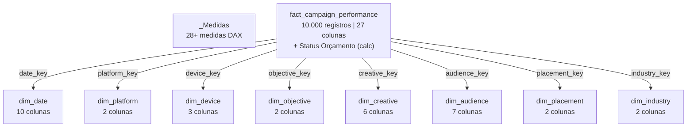
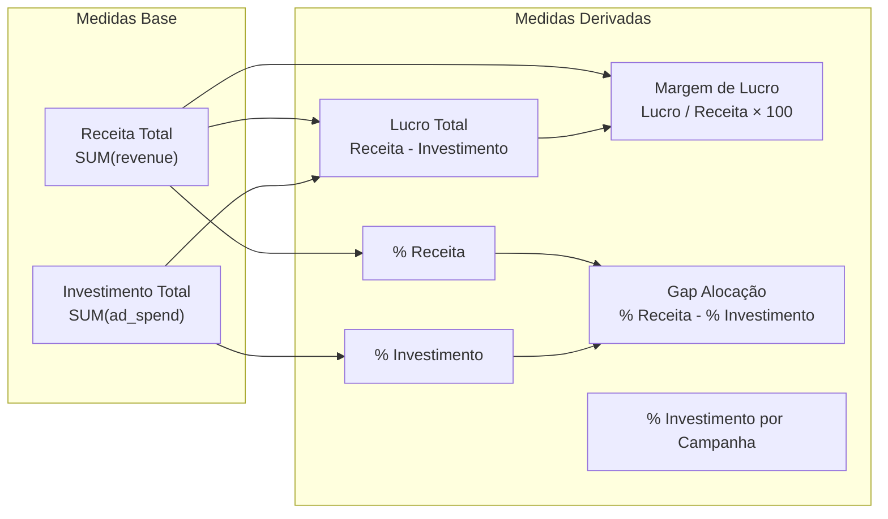
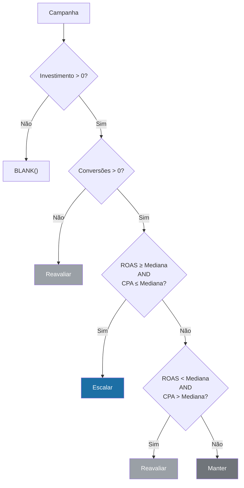

# Guia do Modelo Semântico e Power BI

> How-to guide para entender, manter e estender o modelo semântico `sm_marketing_analytics` e o relatório Power BI.

[Português](semantic-model-guide.md) | [English](semantic-model-guide.en.md)

---

## 1. Estrutura do Modelo Semântico

### Visão Geral

| Atributo | Valor |
|:---|:---|
| **Nome** | `sm_marketing_analytics` |
| **Modo** | DirectLake |
| **Cultura** | en-US |
| **Fonte** | Lakehouse `lh_marketing_analytics` via OneLake |
| **Tabelas** | 1 fato + 8 dimensões + 1 tabela de medidas |
| **Medidas** | 28+ (organizadas em 4 pastas) |
| **Formato de definição** | TMDL (Tabular Model Definition Language) |

### Conexão DirectLake

O modelo conecta diretamente aos arquivos Delta do Lakehouse sem import ou refresh:

```
AzureStorage.DataLake(
    "https://onelake.dfs.fabric.microsoft.com/<workspace-id>/<lakehouse-id>"
)
```

Isso significa que:
- **Não há refresh agendado** — os dados são lidos sob demanda
- **Alterações nas tabelas Delta** refletem automaticamente no relatório
- **Performance** é superior ao Import para dados que mudam frequentemente

### Diagrama de Tabelas e Relacionamentos




---

## 2. Catálogo de Medidas por Categoria

### Pasta: Financeiro



### Pasta: Performance

| Medida | Dependências | Fórmula DAX Simplificada |
|:---|:---|:---|
| **ROAS** | Receita Total, Investimento Total | `DIVIDE(Receita, Investimento, BLANK())` |
| **CPA** | Investimento Total, Conversões Totais | `DIVIDE(Investimento, Conversões, BLANK())` |
| **CTR** | Cliques Totais, Impressões Totais | `DIVIDE(Cliques, Impressões, 0) × 100` |
| **CPC** | Investimento Total, Cliques Totais | `DIVIDE(Investimento, Cliques, 0)` |
| **Taxa de Conversão** | Conversões Totais, Cliques Totais | `DIVIDE(Conversões, Cliques, 0) × 100` |

> **Nota:** ROAS e CPA usam `BLANK()` como fallback para evitar mostrar `0` quando não há dados. CTR, CPC e Taxa de Conversão usam `0` como fallback.

### Pasta: Volume

| Medida | Fórmula |
|:---|:---|
| **Impressões Totais** | `SUM(fact[impressions])` |
| **Cliques Totais** | `SUM(fact[clicks])` |
| **Conversões Totais** | `SUM(fact[conversions])` |
| **Total de Campanhas** | `DISTINCTCOUNT(fact[campaign_id])` |
| **Campanhas Totais** | `DISTINCTCOUNT(fact[campaign_id])` |

### Pasta: Formatação

16 medidas de formatação condicional que retornam códigos de cor HEX. Divididas em 3 padrões:

#### Padrão 1 — Melhor vs. Restante

```dax
-- Usado em: Cor ROAS Plataforma, Cor CPA Plataforma, Cor ROAS Objetivo, etc.
VAR MetricaAtual = [Medida]
VAR MelhorValor =
    MAXX(
        ALLSELECTED(dim[campo]),
        CALCULATE([Medida])
    )
RETURN
    IF(MetricaAtual = MelhorValor, "#1D6FA5", "#5F6368")
```

#### Padrão 2 — Gradiente por Ranking

```dax
-- Usado em: Cor Investimento Plataforma, Cor ROAS Indústria
VAR RankingAtual =
    RANKX(
        ALLSELECTED(dim[campo]),
        CALCULATE([Medida]),, DESC, DENSE
    )
RETURN
    SWITCH(
        RankingAtual,
        1, "#1D6FA5",   -- Destaque
        2, "#40454B",   -- Gradiente escuro
        3, "#5C6268",
        ...
        "#B8BCC0"       -- Padrão (mais claro)
    )
```

#### Padrão 3 — Percentil (Top 10%)

```dax
-- Usado em: Cor ROAS Tabela, Cor CPA Tabela
-- Calcula o percentil 90 entre todas as campanhas selecionadas
-- Destaca em azul apenas as que estão no top 10%
```

---

## 3. Coluna Calculada: Status Orçamento

Esta é a única coluna calculada do modelo. Ela classifica cada campanha para orientar decisões de alocação:



| Status | Significado | Critério |
|:---|:---|:---|
| **Escalar** | Campanha eficiente, aumentar investimento | ROAS ≥ mediana global AND CPA ≤ mediana global |
| **Manter** | Performance mediana, manter orçamento | Não se encaixa em Escalar nem Reavaliar |
| **Reavaliar** | Campanha ineficiente, reduzir ou pausar | ROAS < mediana AND CPA > mediana, ou sem conversões |

---

## 4. Como Adicionar uma Nova Medida

### Passo 1 — Definir no arquivo TMDL

Edite o arquivo `definition/tables/_Medidas.tmdl` e adicione:

```
	measure 'Nome da Medida' =
			
			SUA_FORMULA_DAX_AQUI
		formatString: #,0.00
		displayFolder: NomeDaPasta
		lineageTag: <gere-um-novo-guid>
```

### Passo 2 — Convenções

| Aspecto | Convenção |
|:---|:---|
| **Nome** | Português, capitalizado (ex: `Receita Média por Campanha`) |
| **Display Folder** | `Financeiro`, `Performance`, `Volume` ou `Formatação` |
| **Format String** | `R$ #,0.00` para moeda, `0.00` para percentual, `#,0` para inteiro |
| **DIVIDE** | Sempre usar `DIVIDE()` em vez de `/` para tratar divisão por zero |
| **Fallback** | `BLANK()` para métricas que não devem mostrar zero, `0` para as demais |

### Exemplo Completo

```
	measure 'Receita Média por Campanha' =
			
			DIVIDE(
			    [Receita Total],
			    [Campanhas Totais],
			    BLANK()
			)
		formatString: "R$"\ #,0.00;-"R$"\ #,0.00;"R$"\ #,0.00
		displayFolder: Financeiro
		lineageTag: xxxxxxxx-xxxx-xxxx-xxxx-xxxxxxxxxxxx

		annotation PBI_FormatHint = {"currencyCulture":"pt-BR"}
```

---

## 5. Como Adicionar uma Nova Dimensão (End-to-End)

### Passo 1 — Notebook `nb_04`

Crie a tabela dimensional no PySpark:

```python
dim_nova = (
    gold_campaign_performance
    .select("campo_dimensao")
    .distinct()
    .withColumn("nova_key", F.monotonically_increasing_id() + 1)
)

dim_nova.write.format("delta").mode("overwrite").saveAsTable("dim_nova")
```

Adicione a FK na tabela fato via join.

### Passo 2 — Modelo Semântico (TMDL)

Crie o arquivo `definition/tables/dim_nova.tmdl`:

```
table dim_nova
	sourceLineageTag: [dbo].[dim_nova]

	column nova_key
		dataType: int64
		isHidden
		formatString: 0
		summarizeBy: none
		sourceColumn: nova_key

	column campo_dimensao
		dataType: string
		summarizeBy: none
		sourceColumn: campo_dimensao

	partition dim_nova = entity
		mode: directLake
		source
			entityName: dim_nova
			schemaName: dbo
			expressionSource: 'DirectLake - lh_marketing_analytics'
```

### Passo 3 — Relacionamento

Adicione ao arquivo `definition/relationships.tmdl`:

```
relationship <novo-guid>
	fromColumn: fact_campaign_performance.nova_key
	toColumn: dim_nova.nova_key
```

### Passo 4 — Referência no Modelo

Adicione ao arquivo `definition/model.tmdl`:

```
ref table dim_nova
```

### Passo 5 — Data Quality (nb_05)

Adicione a nova FK ao dicionário de chaves referenciais:

```python
chaves_referenciais["dim_nova"] = "nova_key"
```

---

## 6. Boas Práticas

### Naming

| Elemento | Padrão | Exemplo |
|:---|:---|:---|
| Tabela Fato | `fact_<nome>` | `fact_campaign_performance` |
| Dimensão | `dim_<nome>` | `dim_platform` |
| Surrogate Key | `<nome>_key` | `platform_key` |
| Medida | Português, capitalizado | `Investimento Total` |
| Medida de cor | `Cor <Métrica> <Contexto>` | `Cor ROAS Plataforma` |

### Display Folders

Organize as medidas em pastas por funcionalidade:

```
_Medidas/
├── Financeiro/     → Investimento, Receita, Lucro, Margem, Gap
├── Performance/    → ROAS, CPA, CTR, CPC, Taxa de Conversão
├── Volume/         → Impressões, Cliques, Conversões, Campanhas
└── Formatação/     → Todas as medidas de cor (16 medidas)
```

### Paleta de Cores

| Uso | Cor | HEX |
|:---|:---|:---|
| **Destaque principal** | Azul | `#1D6FA5` |
| **Destaque alternativo** | Azul claro | `#2196F3` |
| **Neutro escuro** | Cinza escuro | `#40454B` |
| **Neutro padrão** | Cinza | `#5F6368` |
| **Neutro médio** | Cinza médio | `#70757A` |
| **Neutro claro** | Cinza claro | `#9AA0A6` |
| **Neutro mais claro** | Cinza muito claro | `#B8BCC0` |
| **Fundo tabela (sem destaque)** | Branco | `#FFFFFF` |

### Colunas Ocultas

As seguintes colunas estão ocultas no modelo porque suas métricas devem ser acessadas exclusivamente via medidas DAX:

- **FKs:** `date_key`, `device_key`, `objective_key`, `creative_key`, `audience_key`, `placement_key`, `industry_key`
- **KPIs na fato:** `CTR`, `CPC`, `conversion_rate`, `CPA`, `ROAS`, `profit`

> **Motivo:** Usar SUM() dessas colunas diretamente no Power BI produziria resultados incorretos. As medidas DAX recalculam os KPIs corretamente no contexto de filtro.

### Sort By Column

| Coluna Visível | Sort By |
|:---|:---|
| `dim_date[month_name]` | `dim_date[month]` |
| `dim_date[month_year]` | `dim_date[year_month]` |

Isso garante que meses e períodos apareçam em ordem cronológica nos visuais do Power BI.
